# BS Realty LLC — System User Manual

**Version 1.0 | March 2026**
**Prepared for: BS Realty LLC Internal Team**

---

## Table of Contents

1. [System Overview](#1-system-overview)
2. [Accessing the System](#2-accessing-the-system)
3. [Client-Facing Website](#3-client-facing-website)
   - 3.1 [Homepage](#31-homepage)
   - 3.2 [Scheduling an Appointment](#32-scheduling-an-appointment)
   - 3.3 [Property Inquiry Form](#33-property-inquiry-form)
   - 3.4 [Insurance Quote Request](#34-insurance-quote-request)
   - 3.5 [Home Improvement Quote](#35-home-improvement-quote)
   - 3.6 [Contact Us Form](#36-contact-us-form)
   - 3.7 [Job Listings & Applying for a Job](#37-job-listings--applying-for-a-job)
   - 3.8 [Become an Agent](#38-become-an-agent)
4. [Admin Dashboard — Getting In](#4-admin-dashboard--getting-in)
   - 4.1 [Logging In](#41-logging-in)
   - 4.2 [Dashboard Layout & Navigation](#42-dashboard-layout--navigation)
   - 4.3 [Notifications Panel](#43-notifications-panel)
   - 4.4 [User Profile Menu](#44-user-profile-menu)
5. [Dashboard Overview Page](#5-dashboard-overview-page)
6. [Managing Contacts](#6-managing-contacts)
7. [Managing Appointments](#7-managing-appointments)
   - 7.1 [Appointment List & Filtering](#71-appointment-list--filtering)
   - 7.2 [Viewing Appointment Details](#72-viewing-appointment-details)
   - 7.3 [Updating Appointment Status](#73-updating-appointment-status)
   - 7.4 [Cancelling an Appointment (With Reason)](#74-cancelling-an-appointment-with-reason)
   - 7.5 [Disabling & Enabling Appointments](#75-disabling--enabling-appointments)
   - 7.6 [Rescheduled Appointments](#76-rescheduled-appointments)
   - 7.7 [Exporting Appointments to CSV](#77-exporting-appointments-to-csv)
8. [Managing Property Inquiries](#8-managing-property-inquiries)
9. [Managing Insurance Quotes](#9-managing-insurance-quotes)
10. [Managing Home Improvement Quotes](#10-managing-home-improvement-quotes)
11. [Managing Job Applications](#11-managing-job-applications)
12. [Managing Agent Applications](#12-managing-agent-applications)
13. [User Management](#13-user-management)
14. [Analytics](#14-analytics)
15. [Surveys & Testimonials](#15-surveys--testimonials)
16. [Appointment Preferences (Configuration)](#16-appointment-preferences-configuration)
    - 16.1 [Appointment Categories](#161-appointment-categories)
    - 16.2 [Meeting Preferences](#162-meeting-preferences)
    - 16.3 [Business Hours](#163-business-hours)
    - 16.4 [Blocked Dates](#164-blocked-dates)
17. [Settings Page](#17-settings-page)
18. [Status Reference Guide](#18-status-reference-guide)
19. [Role & Permission Guide](#19-role--permission-guide)
20. [Email Notifications — What Gets Sent Automatically](#20-email-notifications--what-gets-sent-automatically)
21. [Frequently Asked Questions](#21-frequently-asked-questions)

---

## 1. System Overview

**BS Realty LLC** is a comprehensive real estate services platform that connects clients with a full suite of services including:

- **Real Estate** – Buy, sell, and rent properties.
- **Mortgage Services** – Home loans and refinancing guidance.
- **Insurance** – Auto, Home, Commercial, and Workers' Compensation quotes.
- **Home Improvement** – Renovation and contractor quote requests.
- **Tax & Financial Counseling** – Professional accounting services.
- **Careers** – Job postings and online applications.
- **Agent Recruitment** – Online agent application portal.

The platform is divided into two major parts:

| Part | Who Uses It | URL |
|------|-------------|-----|
| **Public Website** | Clients, visitors | `https://bsrealtyllc.com` |
| **Admin Dashboard** | Admins, Agents | `https://bsrealtyllc.com/dashboard` |

---

## 2. Accessing the System

### Public Website
No login is required. Anyone can browse the site, fill out forms, and schedule appointments.

### Admin Dashboard
Access requires a registered account with the role of **Admin** or **Agent**. You must log in at `/login`. Authentication is handled through the **Single Sign-On (SSO)** service, which also manages your password, two-factor authentication (2FA), and active sessions.

> **Important:** New admin or agent accounts must be approved by an existing administrator before they become active.

---

## 3. Client-Facing Website

### 3.1 Homepage

The homepage is the first thing visitors see. It is organized into the following sections:

| Section | Description |
|---------|-------------|
| **Hero Banner** | Company headline, tagline, and call-to-action buttons. |
| **Services Preview** | A snapshot of all services offered (Real Estate, Mortgage, Insurance, etc.), each linking to a dedicated services page. |
| **Testimonials** | Real client reviews and ratings (approved by admin via the Surveys module). |
| **Accomplishments** | Key company milestones and counters (e.g., properties sold, clients served). |
| **Our Journey** | Timeline of the company's growth story. |
| **Courses / Training** | Educational content and training programs offered by BS Realty. |
| **Appointment Booking** | Quick-access appointment scheduling form embedded directly on the homepage. |

---

### 3.2 Scheduling an Appointment

#### Step 1 — Fill in your details

<figure class="screenshot side-labels">
  <div class="img-wrap">
    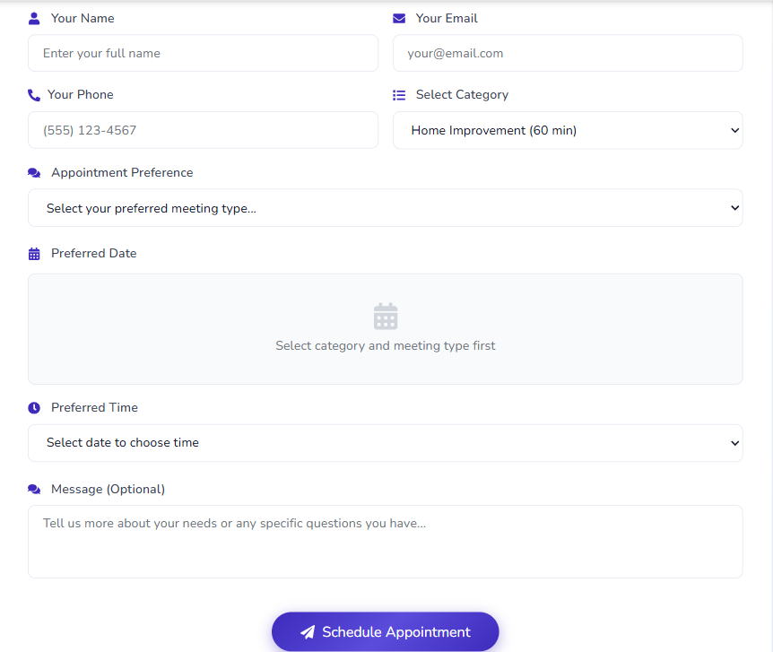
    <div class="slabel" style="--sl:13%"><span>Full Name<em>your legal name</em></span></div>
    <div class="slabel" style="--sl:27%"><span>Email Address<em>confirmation sent here</em></span></div>
    <div class="slabel" style="--sl:41%"><span>Phone Number<em>10-digit number</em></span></div>
    <div class="slabel" style="--sl:55%"><span>Service Category<em>choose from dropdown</em></span></div>
    <div class="slabel" style="--sl:69%"><span>Meeting Preference<em>In-Person / Virtual / Phone</em></span></div>
    <div class="slabel" style="--sl:84%"><span>Message<em>optional — extra notes</em></span></div>
  </div>
  <figcaption>Fig 3.1 — Step 1: fill in your name, contact details, service category and meeting preference</figcaption>
</figure>

#### Step 2 — Select a date

<figure class="screenshot side-labels">
  <div class="img-wrap">
    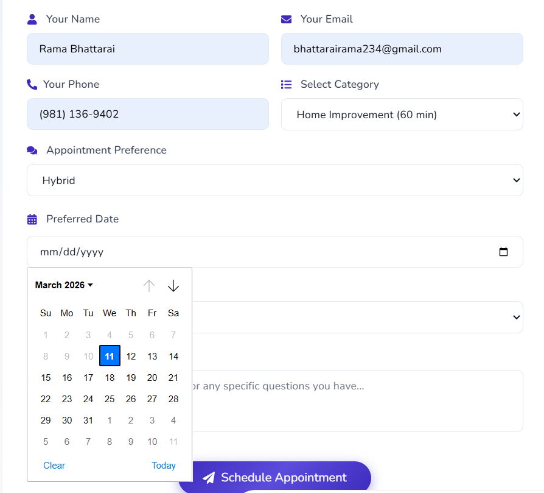
    <div class="slabel" style="--sl:30%"><span>Available date<em>click to select</em></span></div>
    <div class="slabel" style="--sl:55%"><span>Blocked / unavailable<em>cannot be booked</em></span></div>
    <div class="slabel" style="--sl:83%"><span>Your Timezone<em>confirm or change if needed</em></span></div>
  </div>
  <figcaption>Fig 3.2 — Step 2: pick an available date from the calendar</figcaption>
</figure>

#### Step 3 — Choose a time slot

<figure class="screenshot side-labels">
  <div class="img-wrap">
    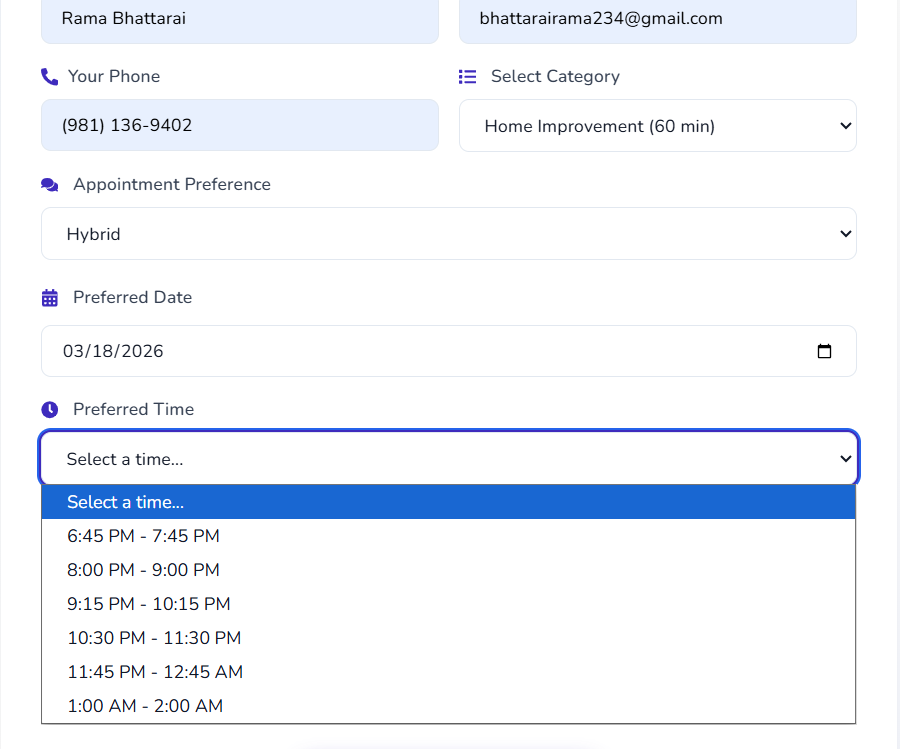
    <div class="slabel" style="--sl:25%"><span>Available slot<em>click to pick</em></span></div>
    <div class="slabel" style="--sl:50%"><span>Already booked<em>cannot select</em></span></div>
    <div class="slabel" style="--sl:75%"><span>Your selected slot<em>will be confirmed</em></span></div>
  </div>
  <figcaption>Fig 3.3 — Step 3: select an available time slot for your appointment</figcaption>
</figure>

#### Step 4 — Review and confirm

<figure class="screenshot side-labels">
  <div class="img-wrap">
    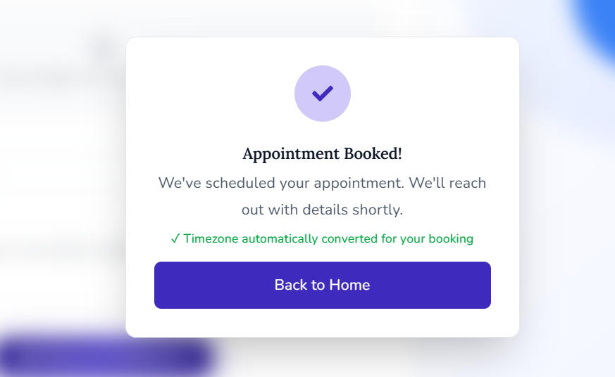
    <div class="slabel" style="--sl:35%"><span>Booking summary<em>review your details</em></span></div>
    <div class="slabel" style="--sl:78%"><span>Book Appointment<em>click to confirm &amp; submit</em></span></div>
  </div>
  <figcaption>Fig 3.4 — Step 4: review your booking summary then click Book Appointment to submit</figcaption>
</figure>

Clients can book a consultation directly from the website.

**How to book:**

1. Navigate to the **Schedule an Appointment** section (on the homepage or at `/appointment`).
2. Fill in the required fields:
   - **Full Name** – Your legal name.
   - **Email Address** – Where your confirmation will be sent.
   - **Phone Number** – 10-digit number (dashes/parentheses accepted).
   - **Service Category** – Select the type of consultation (Real Estate, Mortgage, Home Improvement, Tax & Accounting, or Other).
   - **Meeting Preference** – How you'd like to meet (In-Person, Virtual, Phone Call). Options depend on the selected category.
   - **Date** – Pick from the calendar. Only available (non-blocked) dates are selectable.
   - **Time Slot** – Available times appear once a date, category, and preference are selected.
   - **Message** *(optional)* – Any additional notes for your appointment.

3. Click **Book Appointment**.

**What happens next:**
- You receive a **confirmation email** with full appointment details.
- The BS Realty admin team is **notified in real time** via the dashboard notification system.
- The appointment appears in the admin dashboard for the team to review.

> **Note:** Bookings must be made at least **24 hours in advance** and no more than the maximum advance days allowed (configurable by admin). Weekend bookings may or may not be available depending on the system configuration.

---

### 3.3 Property Inquiry Form

<figure class="screenshot">
  <div class="img-wrap">
    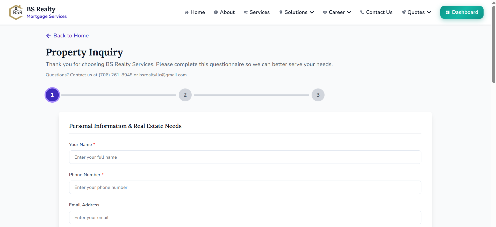
    
  </div>
  <figcaption>Fig 3.5 — Property inquiry form with contact details, preferences, and property requirements</figcaption>
</figure>

For clients interested in buying, selling, or renting property.

**Navigate to:** `/property-inquiry`

**The form collects:**

| Section | Details |
|---------|---------|
| **Contact Info** | Name, phone, email, preferred contact method (Phone, Text, or Email) |
| **Real Estate Needs** | What the client wants: Buy, Sell, Rent, commercial property, land, etc. |
| **Property Type** | Single-family, Condo, Multi-family, Land, New Construction |
| **Budget & Timeline** | Price range and expected timeframe (Immediately, 1–3 months, 3+) |
| **Preferred Locations** | City, neighborhood, or area preferences |
| **Financing** | Cash purchase, Mortgage loan, or Refinance |
| **Loan Officer Assistance** | Whether they want help with financing |
| **Investment Interest** | Residential, Commercial, Land Development, or None |
| **Insurance Interest** | Homeowners, Renters, Auto, Business insurance, or None |
| **Additional Notes** | Open-ended comments |
| **Concerns** | Specific worries or questions |

After submission, the inquiry is logged in the admin dashboard and a **real-time notification** is sent to admins.

---

### 3.4 Insurance Quote Request

For clients who want insurance pricing.

**Navigate to:** `/insurance-quote`

This is a multi-section form:

| Section | Key Fields |
|---------|-----------|
| **Personal Info** | Full name, date of birth, gender, email, phone |
| **Quote Type** | Auto, Home, Commercial, Workers' Compensation (multiple can be selected) |
| **Driver's License** | DL number, state, expiry, license status |
| **Address** | Primary address, years at address, previous address |
| **Personal Details** | Marital status, occupation, military status |
| **Co-Applicants** | Whether there are additional drivers/household members (up to 10) |
| **Auto Section** *(if Auto selected)* | Prior carrier, years insured, VIN, vehicle use, mileage, coverage types |
| **Property Section** *(if Home selected)* | Property address, dwelling usage, foundation type, roof type |
| **Accident/Violation History** | For auto quotes, any past accidents or violations |
| **Paperless Preference** | Whether the client prefers paperless communication |

---

### 3.5 Home Improvement Quote

<figure class="screenshot">
  <div class="img-wrap">
    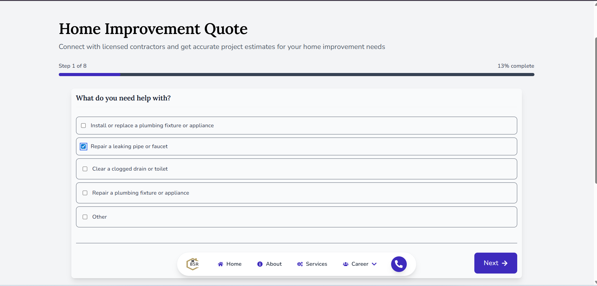
    
  </div>
  <figcaption>Fig 3.6 — Home improvement quote form with project details and contact information</figcaption>
</figure>

For clients needing renovation or home repair services.

**Navigate to:** `/home-improvement-quote`

**The form collects:**
- **Type of Help Needed** – Installation, replacement, repair, etc.
- **Items to Install/Replace** – Specific items (e.g., windows, flooring, HVAC)
- **Property Type** – Residential or Commercial
- **Areas of Work** – Kitchen, Bathroom, Basement, Exterior, etc.
- **Project Timeline** – How soon the work is needed
- **Project Description** – Free-text description of the scope
- **Property Address** – Where the work will happen
- **Contact Info** – Name, email, phone
- **Update Preferences** – Whether the client wants text and/or email updates during the project

---

### 3.6 Contact Us Form

For general inquiries not covered by other forms.

**Navigate to:** `/contact`

<figure class="screenshot side-labels">
  <div class="img-wrap">
    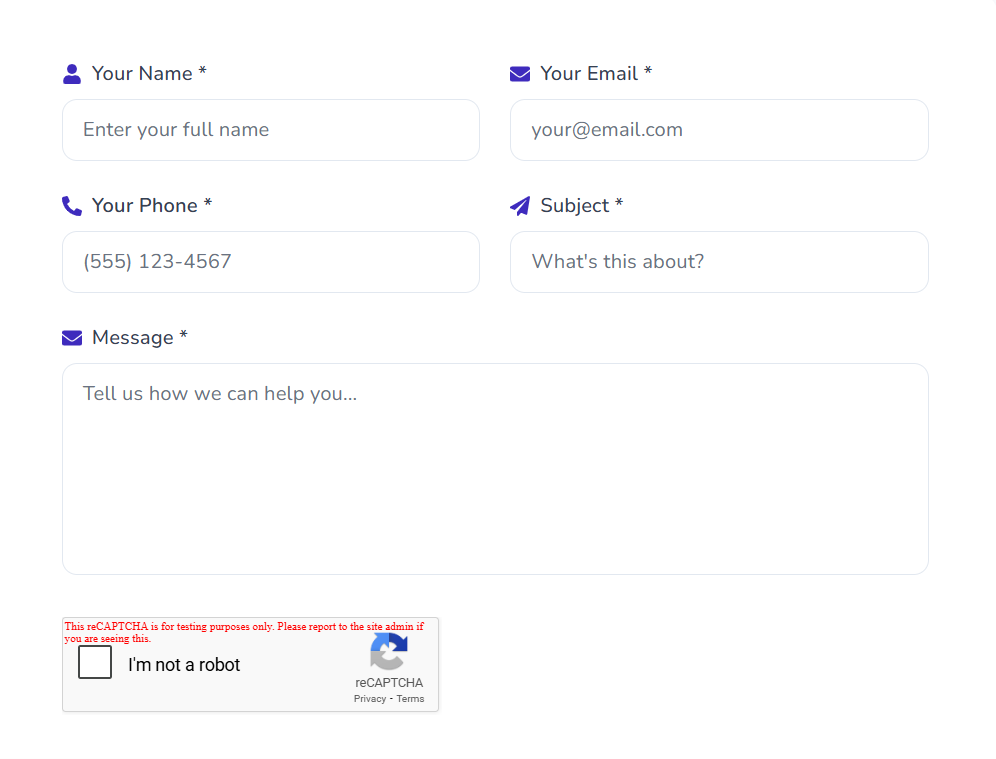
    <div class="slabel" style="--sl:15%"><span>Full Name<em>your legal name</em></span></div>
    <div class="slabel" style="--sl:30%"><span>Email Address<em>where the reply is sent</em></span></div>
    <div class="slabel" style="--sl:45%"><span>Phone Number<em>10-digit number</em></span></div>
    <div class="slabel" style="--sl:60%"><span>Subject<em>brief reason for contact</em></span></div>
    <div class="slabel" style="--sl:78%"><span>Message<em>your full inquiry</em></span></div>
  </div>
  <figcaption>Fig 3.6 — Contact us form: fill in all fields and complete the CAPTCHA before submitting</figcaption>
</figure>

**Required fields:**
- Full Name
- Email Address
- Phone Number
- Subject
- Message

> The form includes **reCAPTCHA** verification to prevent spam. If your submission fails, ensure you complete the CAPTCHA challenge.

---

### 3.7 Job Listings & Applying for a Job

**Navigate to:** `/job-listings`

<figure class="screenshot side-labels">
  <div class="img-wrap">
    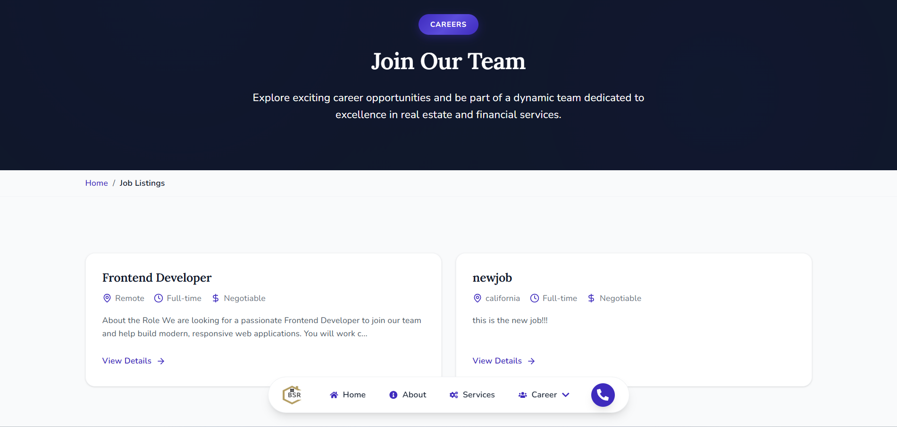
    <div class="slabel" style="--sl:20%"><span>Job Title<em>position being offered</em></span></div>
    <div class="slabel" style="--sl:38%"><span>Location &amp; Type<em>on-site / remote / hybrid</em></span></div>
    <div class="slabel" style="--sl:56%"><span>Salary Range<em>compensation details</em></span></div>
    <div class="slabel" style="--sl:75%"><span>View Details<em>click to read full listing</em></span></div>
  </div>
  <figcaption>Fig 3.7 — Job listings page showing all open positions at BS Realty</figcaption>
</figure>

The Jobs page displays all currently open positions at BS Realty. Each listing shows:
- Job Title
- Location
- Employment Type (Full-time, Part-time, Contract, Freelance, Internship)
- Salary/Compensation Range
- Requirements & Qualifications

<figure class="screenshot side-labels">
  <div class="img-wrap">
    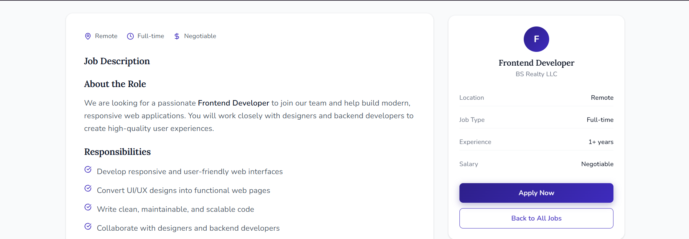
    <div class="slabel" style="--sl:15%"><span>Job Title &amp; Details<em>role, type, location</em></span></div>
    <div class="slabel" style="--sl:35%"><span>Requirements<em>qualifications needed</em></span></div>
    <div class="slabel" style="--sl:55%"><span>Responsibilities<em>what the role involves</em></span></div>
    <div class="slabel" style="--sl:78%"><span>Apply Now<em>click to open application form</em></span></div>
  </div>
  <figcaption>Fig 3.8 — Job detail page: review the full description, then click Apply Now</figcaption>
</figure>

**To apply:**
1. Click on a job listing to view full details at `/job-details/[job-slug]`.
2. Click **Apply Now** to open the application form.
3. Complete all sections:

<figure class="screenshot side-labels">
  <div class="img-wrap">
    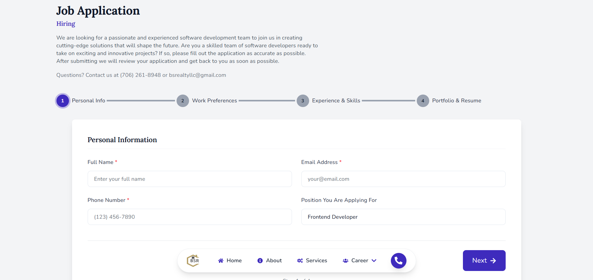
    <div class="slabel" style="--sl:12%"><span>Contact Info<em>name, email, phone</em></span></div>
    <div class="slabel" style="--sl:26%"><span>Work Preferences<em>schedule &amp; work style</em></span></div>
    <div class="slabel" style="--sl:40%"><span>Experience<em>skills &amp; years of experience</em></span></div>
    <div class="slabel" style="--sl:54%"><span>Compensation<em>expected salary range</em></span></div>
    <div class="slabel" style="--sl:66%"><span>Portfolio &amp; Motivation<em>links, certifications, why BS Realty</em></span></div>
    <div class="slabel" style="--sl:80%"><span>Resume Upload<em>PDF / DOC / DOCX — 5MB max</em></span></div>
  </div>
  <figcaption>Fig 3.9 — Job application form: fill in all sections and upload your resume before submitting</figcaption>
</figure>

| Section | Fields |
|---------|--------|
| **Contact Info** | Name, email, phone |
| **Work Preferences** | Full-time/Part-time, Remote/On-site/Hybrid, Start availability |
| **Experience** | Years of experience, technical skills, programming languages/tools |
| **Compensation** | Expected compensation or salary range |
| **Work Style** | Experience with startups, availability across time zones |
| **Portfolio** | Links, certifications, description of past/recent projects |
| **Motivation** | Why they want to work at BS Realty, referral information |
| **Resume** | Upload your resume (PDF, DOC, DOCX — 5MB max) |

4. Submit the application.

After submission, you receive a confirmation and the admin team is notified.

---

### 3.8 Become an Agent

For real estate professionals who want to join the BS Realty team.

**Navigate to:** `/become-agent`

The application is split into **4 steps** — the progress bar at the top of the form shows where you are at all times.

| Step | Section |
|------|---------|
| 1 | Personal Info |
| 2 | Professional Background |
| 3 | Questionnaire |
| 4 | Documents |

<figure class="screenshot side-labels">
  <div class="img-wrap">
    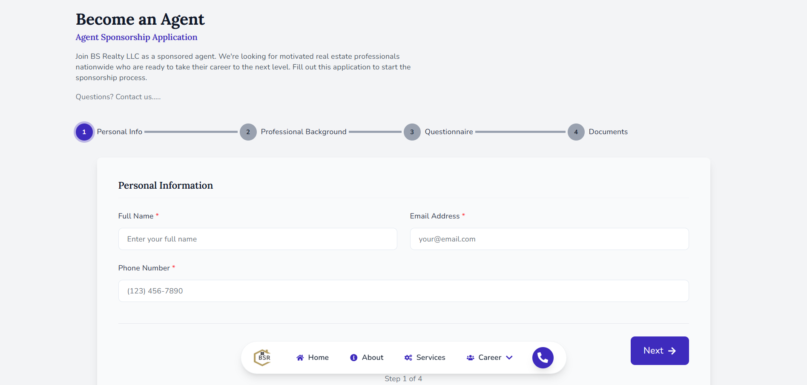
    <div class="slabel" style="--sl:33%"><span>Step progress bar<em>tracks which of the 4 steps you're on</em></span></div>
    <div class="slabel" style="--sl:55%"><span>Full Name &amp; Email<em>required — personal contact details</em></span></div>
    <div class="slabel" style="--sl:72%"><span>Phone Number<em>required — 10-digit number</em></span></div>
    <div class="slabel" style="--sl:88%"><span>Next →<em>saves Step 1 and moves to Step 2</em></span></div>
  </div>
  <figcaption>Fig 3.10 — Step 1 of 4: Personal Info. Fill in your name, email, and phone, then click Next to continue.</figcaption>
</figure>

> **Tip:** You must complete all 4 steps before submitting. Use the **Next** button to advance and the **Back** button to review previous steps.

**All fields collected across the 4 steps:**

| Field | Details |
|-------|---------|
| Name, Email, Phone | Contact details |
| License Status | Licensed, Inactive, Expired, Pre-licensing, or None |
| License Number & States | For licensed agents |
| Years of Experience | 0–1, 1–3, 3–5, 5–10, or 10+ years |
| Current Brokerage | If currently affiliated |
| Areas of Expertise | Real Estate, Mortgage, Tax, Insurance, Home Improvement, Others |
| Availability | Full-time, Part-time, or Both |
| Work Eligibility | US Citizen, Permanent Resident, H1B, TN Visa, Other Visa |
| How Did You Hear | Online Search, Social Media, Referral, etc. |
| Resume | Upload required |
| License Copy | Upload (optional) |
| ID Card | Upload (optional) |

---

## 4. Admin Dashboard — Getting In

### 4.1 Logging In

<figure class="screenshot side-labels">
  <div class="img-wrap">
    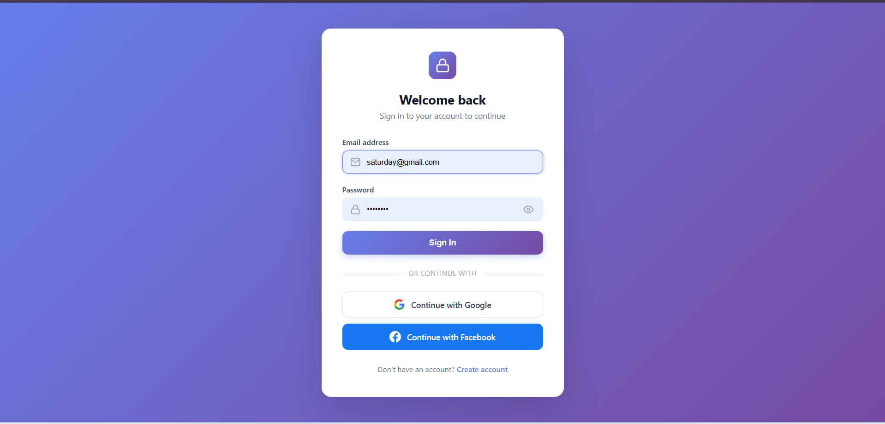
    <div class="slabel" style="--sl:36%"><span>Email Address<em>your registered admin email</em></span></div>
    <div class="slabel" style="--sl:50%"><span>Password<em>your SSO account password</em></span></div>
    <div class="slabel" style="--sl:62%"><span>Sign In<em>click to log in</em></span></div>
    <div class="slabel" style="--sl:76%"><span>Continue with Google<em>SSO via Google account</em></span></div>
    <div class="slabel" style="--sl:87%"><span>Continue with Facebook<em>SSO via Facebook account</em></span></div>
  </div>
  <figcaption>Fig 4.1 — Admin login page: enter your credentials and click Sign In, or use Google / Facebook SSO</figcaption>
</figure>

**How to log in:**

1. Go to `/login`.
2. Enter your **email address** and **password** linked to your SSO account.
3. If 2FA is enabled, complete the verification step.
4. You are redirected to the **Dashboard Overview**.

> If you cannot log in, contact your administrator or visit the SSO portal to reset your password.

---

### 4.2 Dashboard Layout & Navigation

<figure class="screenshot side-labels">
  <div class="img-wrap">
    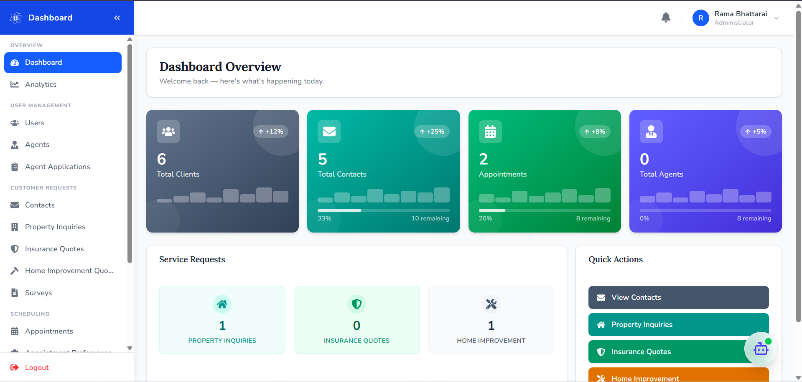
    <div class="slabel" style="--sl:5%"><span>Top Header<em>notifications &amp; user profile menu</em></span></div>
    <div class="slabel" style="--sl:24%"><span>Sidebar Navigation<em>links to all admin modules</em></span></div>
    <div class="slabel" style="--sl:44%"><span>Stats Cards<em>live metric summaries at a glance</em></span></div>
    <div class="slabel" style="--sl:65%"><span>Service Requests<em>property, insurance &amp; home improvement counts</em></span></div>
    <div class="slabel" style="--sl:88%"><span>Quick Actions<em>shortcuts to common tasks</em></span></div>
  </div>
  <figcaption>Fig 4.2 — Dashboard layout showing sidebar navigation and main content area</figcaption>
</figure>

The dashboard uses a consistent layout with three main areas:

```
┌─────────────────────────────────────────────────────────────────┐
│  [Sidebar - Left]         [Top Bar]              [Content Area] │
│                                                                  │
│  ┌ BS Realty Logo ──────┐  ┌ ─── Notification Bell | User ─ ┐  │
│  │ Dashboard            │  └────────────────────────────────┘  │
│  │                      │                                        │
│  │ MAIN                 │   ┌─────────────────────────────────┐ │
│  │  ○ Overview          │   │                                 │ │
│  │  ○ Contacts          │   │       Page Content              │ │
│  │  ○ Appointments      │   │                                 │ │
│  │  ○ Property Inquiries│   └─────────────────────────────────┘ │
│  │  ○ Insurance Quotes  │                                        │
│  │  ○ Home Improvement  │                                        │
│  │                      │                                        │
│  │ JOBS                 │                                        │
│  │  ○ Job Applications  │                                        │
│  │  ○ Agent Applications│                                        │
│  │                      │                                        │
│  │ ADMIN                │                                        │
│  │  ○ Users             │                                        │
│  │  ○ Analytics         │                                        │
│  │  ○ Surveys           │                                        │
│  │  ○ Notifications     │                                        │
│  │  ○ Apt. Preferences  │                                        │
│  │  ○ Settings          │                                        │
│  │                      │                                        │
│  │ [Logout Button]      │                                        │
│  └──────────────────────┘                                        │
└─────────────────────────────────────────────────────────────────┘
```

**Sidebar Controls:**
- Click the **« / »** arrow buttons at the top of the sidebar to **collapse or expand** it. Collapsed mode shows only icons; expanded mode shows icons + labels.
- Your sidebar preference is **saved automatically** between sessions.
- On mobile, tap the **hamburger menu (☰)** in the top bar to open the sidebar as an overlay.

**Navigation sections differ by role:**
- **Admins** see all sections listed above.
- **Agents** see a limited subset relevant to their responsibilities (primarily operational sections, not system administration).

---

### 4.3 Notifications Panel

The **bell icon (🔔)** in the top-right corner shows real-time alerts for new incoming activity.

<figure class="screenshot side-labels">
  <div class="img-wrap">
    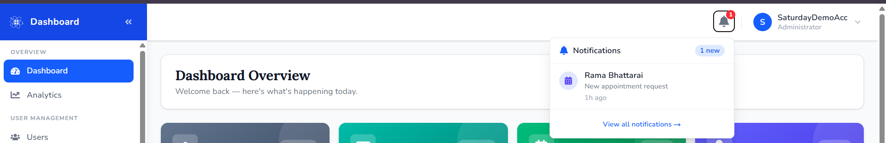
    <div class="slabel" style="--sl:10%"><span>Bell Icon<em>click to open the notifications dropdown</em></span></div>
    <div class="slabel" style="--sl:55%"><span>Notification Item<em>type icon, title, snippet &amp; time ago</em></span></div>
    <div class="slabel" style="--sl:88%"><span>View All Link<em>opens the full notifications page</em></span></div>
  </div>
  <figcaption>Fig 4.3 — Notifications dropdown showing recent activity and alerts</figcaption>
</figure>

- A **red badge** with a number indicates how many unread notifications you have. If there are more than 9, it shows **9+**.
- Click the bell to open the **Notifications Dropdown**, which shows the most recent notifications with:
  - An icon for the notification type
  - Title and a short message snippet
  - Time ago (e.g., "2m ago", "3h ago", "1d ago")

**Notification Types:**

| Type |
|------|
| New Contact Submission |
| New Appointment Booked |
| Property Inquiry |
| Insurance Quote |
| Job Application |
| Agent Application |
| Home Improvement Quote |
| Client Registration |
| Agent Registration |
| Survey Submitted |

**Clicking a notification:**
- Navigates you directly to the relevant section/record.
- Automatically marks the item's status as "pending" (acknowledging you have seen it).
- Removes the notification from the unread count.

<figure class="screenshot side-labels">
  <div class="img-wrap">
    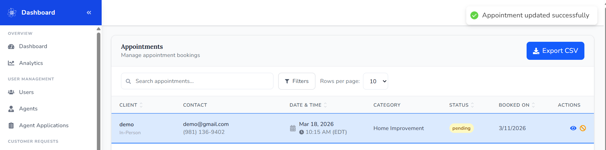
    <div class="slabel" style="--sl:7%"><span>Success Toast<em>confirms the status was auto-updated</em></span></div>
    <div class="slabel" style="--sl:35%"><span>Appointments Table<em>lists all bookings with sortable columns</em></span></div>
    <div class="slabel" style="--sl:62%"><span>Pending Badge<em>status set automatically on notification click</em></span></div>
    <div class="slabel" style="--sl:88%"><span>Action Buttons<em>view details or cancel the appointment</em></span></div>
  </div>
  <figcaption>Fig 4.4 — Appointment status automatically updated to "pending" when accessed via notification</figcaption>
</figure>

Click **"View all notifications →"** at the bottom of the dropdown to see the full Notifications page.

---

### 4.4 User Profile Menu

Click your **name/avatar** in the top-right corner. The dropdown shows:
- Your display name and email
- Your role badge (Admin, Agent, or Client)
- Links to **Profile** and **Settings**
- **Sign Out** button

<figure class="screenshot side-labels">
  <div class="img-wrap">
    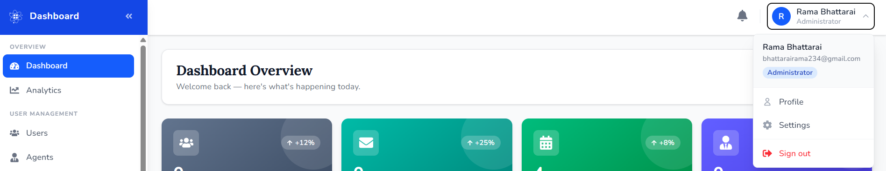
    <div class="slabel" style="--sl:8%"><span>Profile Button<em>click your name / avatar to open the menu</em></span></div>
    <div class="slabel" style="--sl:50%"><span>Name, Email &amp; Role<em>your display name, email and role badge</em></span></div>
    <div class="slabel" style="--sl:88%"><span>Profile, Settings &amp; Sign Out<em>account links and end session</em></span></div>
  </div>
  <figcaption>Fig 4.5 — User profile menu showing account details and navigation options</figcaption>
</figure>

---

## 5. Dashboard Overview Page

**Navigate to:** `/dashboard`

This is the first page you see after logging in. It provides a bird's-eye view of the system.

<figure class="screenshot side-labels">
  <div class="img-wrap">
    
    <div class="slabel" style="--sl:8%"><span>Page Title<em>confirms you're on the Dashboard Overview</em></span></div>
    <div class="slabel" style="--sl:38%"><span>Stat Cards<em>live counts for clients, contacts, appointments &amp; agents</em></span></div>
    <div class="slabel" style="--sl:65%"><span>Service Requests<em>quick counts for property, insurance &amp; home improvement</em></span></div>
    <div class="slabel" style="--sl:88%"><span>Quick Actions<em>shortcuts to navigate directly to key modules</em></span></div>
  </div>
  <figcaption>Fig 5.1 — Dashboard Overview showing stat cards, service request counts and quick actions</figcaption>
</figure>

### Key Metrics (Stat Cards)

At the top, four gradient cards display live data:

| Card | What It Shows |
|------|--------------|
| **Total Clients** | Number of users with the "client" role |
| **Total Contacts** | Total general contact form submissions |
| **Appointments** | Total appointment bookings (all statuses) |
| **Total Agents** | Active agents in the system |

Each card also includes a **sparkline mini-chart** and a **trend indicator** (e.g., +12%, +25%).

### Service Requests Section

Below the stat cards, a 3-column breakdown shows quick counts for:
- **Property Inquiries** total
- **Insurance Quotes** total
- **Home Improvement Quotes** total

### Quick Actions Panel

A sidebar panel with shortcut buttons to navigate directly to:
- View Contacts
- Property Inquiries
- Insurance Quotes
- Home Improvement
- View Reports

---

## 6. Managing Contacts

<figure class="screenshot side-labels">
  <div class="img-wrap">
    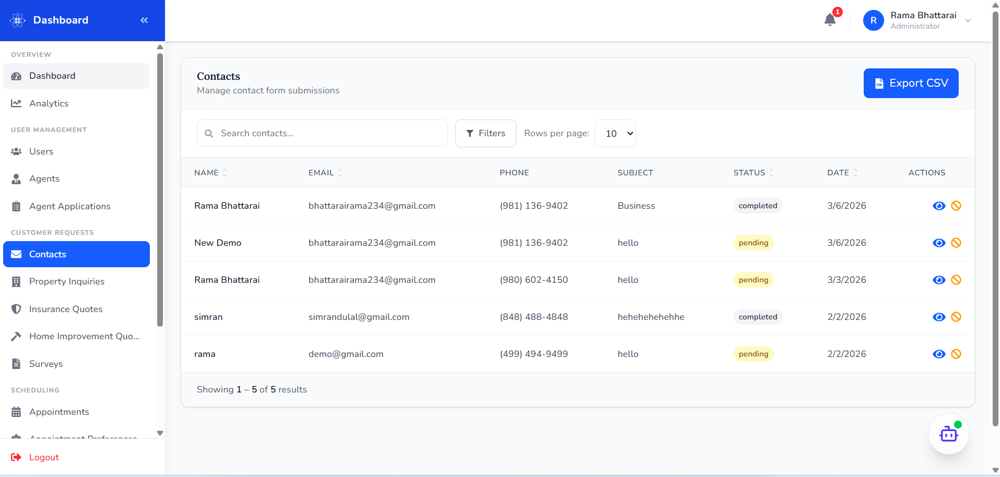
    <div class="slabel" style="--sl:12%"><span>Page Header<em>section title and Export CSV button</em></span></div>
    <div class="slabel" style="--sl:27%"><span>Search &amp; Filters<em>find contacts by keyword or filter by status</em></span></div>
    <div class="slabel" style="--sl:43%"><span>Table Headers<em>sortable columns — name, email, phone, subject, status, date</em></span></div>
    <div class="slabel" style="--sl:62%"><span>Status Badges<em>completed (green) or pending (yellow)</em></span></div>
    <div class="slabel" style="--sl:87%"><span>Action Buttons<em>view details or disable a contact</em></span></div>
  </div>
  <figcaption>Fig 6.1 — Contacts management interface showing search, filters, and action controls</figcaption>
</figure>

**Navigate to:** `/dashboard/contacts`

This page lists all general contact form submissions received from the website's **Contact Us** page.

### Viewing Contacts

<figure class="screenshot side-labels">
  <div class="img-wrap">
    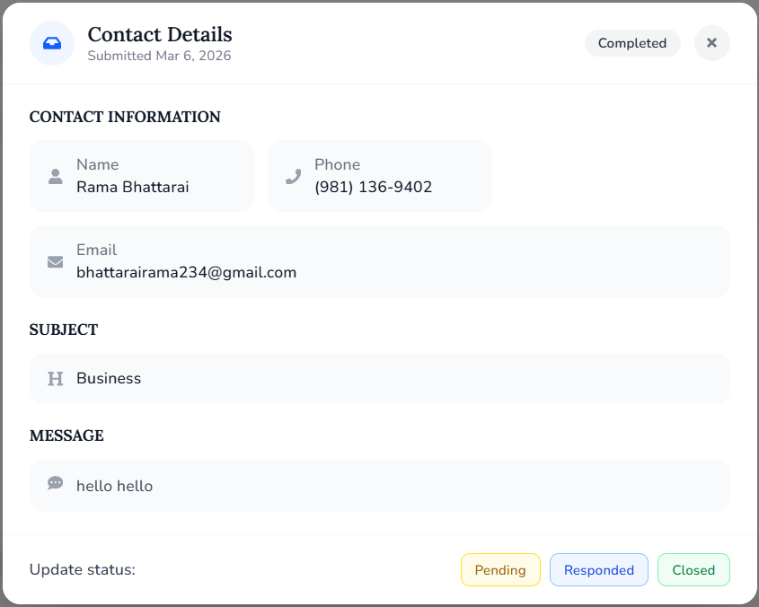
    <div class="slabel" style="--sl:8%"><span>Modal Header<em>title, submission date, current status badge &amp; close</em></span></div>
    <div class="slabel" style="--sl:28%"><span>Contact Information<em>name, phone number and email address</em></span></div>
    <div class="slabel" style="--sl:52%"><span>Subject<em>topic of the contact submission</em></span></div>
    <div class="slabel" style="--sl:70%"><span>Message<em>full text of the contact inquiry</em></span></div>
    <div class="slabel" style="--sl:90%"><span>Update Status<em>set to Pending, Responded or Closed</em></span></div>
  </div>
  <figcaption>Fig 6.2 — Contact detail view showing full information and status management</figcaption>
</figure>

- Submissions are displayed in a data table with columns: **Name, Email, Phone, Subject, Status, Date, Actions**.
- Click the **eye icon (👁)** in the Actions column to open a full detail view of the contact.

### Searching & Filtering
- Use the **search bar** to find contacts by name, email, or phone.
- Use the **Status filter** dropdown to filter by:
  - **New** – Just submitted, not yet reviewed.
  - **Pending** – Being reviewed by the team.
  - **Completed** – Inquiry resolved.
  - **Cancelled** – Submission marked as not needed.

### Updating Status
Open a contact record and use the status action buttons to move it through the workflow.

### Spam Contacts
Contacts flagged as spam (`isSpam: true`) can be identified in the system. Spam contacts are tracked in the database for auditing.

### Exporting
Use the **Export CSV** button to download the current filtered list as a spreadsheet file.

---

## 7. Managing Appointments

**Navigate to:** `/dashboard/appointments`

The Appointments page is the most feature-rich operational section in the dashboard.

### 7.1 Appointment List & Filtering

<figure class="screenshot side-labels">
  <div class="img-wrap">
    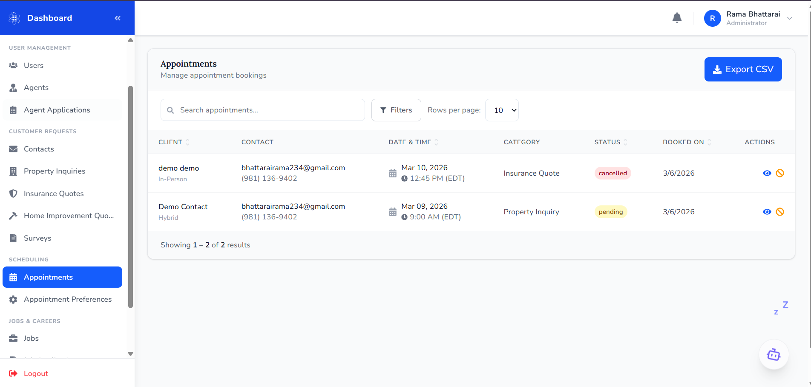
    <div class="slabel" style="--sl:12%"><span>Page Header<em>section title and Export CSV button</em></span></div>
    <div class="slabel" style="--sl:27%"><span>Search &amp; Filters<em>search by name or filter by status, category &amp; date</em></span></div>
    <div class="slabel" style="--sl:43%"><span>Table Headers<em>sortable columns — client, contact, date &amp; time, category, status</em></span></div>
    <div class="slabel" style="--sl:62%"><span>Status Badges<em>cancelled (red) or pending (yellow) — color-coded per state</em></span></div>
    <div class="slabel" style="--sl:85%"><span>Action Buttons<em>view details or disable the appointment</em></span></div>
  </div>
  <figcaption>Fig 7.1 — Appointments management interface with filters and action controls</figcaption>
</figure>

The table shows all appointments with columns:
- **Client** – Client name and meeting preference type (sub-label)
- **Contact** – Email and formatted phone number
- **Date & Time** – Displayed in business timezone with abbreviation (e.g., EST)
- **Category** – Service type (Real Estate, Mortgage, etc.)
- **Status** – Color-coded badge
- **Booked On** – When the appointment was created

**Available filters:**
- **Status:** New | Pending | Confirmed | Completed | Cancelled
- **Category:** Real Estate Consultation | Mortgage Services | Home Improvement | Tax and Accounting | Other
- **Search:** Name, email, or phone

Use **Clear Filters** to reset all filters at once.

---

### 7.2 Viewing Appointment Details

<figure class="screenshot side-labels">
  <div class="img-wrap">
    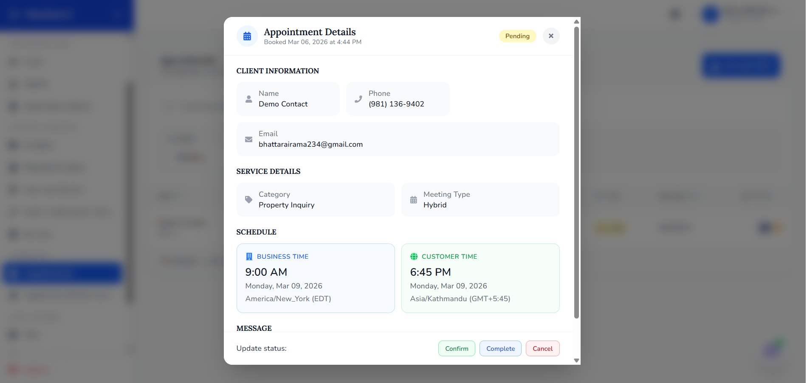
    <div class="slabel" style="--sl:9%"><span>Modal Header<em>appointment title, booking date, status badge &amp; close</em></span></div>
    <div class="slabel" style="--sl:26%"><span>Client Information<em>name, phone number and email address</em></span></div>
    <div class="slabel" style="--sl:46%"><span>Service Details<em>category and meeting type (In-Person / Virtual / Hybrid)</em></span></div>
    <div class="slabel" style="--sl:65%"><span>Schedule<em>business time (EDT) alongside customer local time</em></span></div>
    <div class="slabel" style="--sl:91%"><span>Update Status<em>confirm, complete or cancel the appointment</em></span></div>
  </div>
  <figcaption>Fig 7.2 — Appointment details modal showing client info, schedule, and action controls</figcaption>
</figure>

Click the **eye icon (👁)** on any appointment row to open the **Appointment Details Modal**.

The modal displays:

**Rescheduled Banner** *(shown if this was rescheduled from a previous booking)*
- A purple banner appears with a "View original" button linking to the original appointment.

**Client Information:**
- Full name
- Phone (formatted)
- Email

**Service Details:**
- Category (e.g., Real Estate Consultation)
- Meeting Type / Preference (e.g., In-Person, Virtual)

**Schedule** *(shown in two time zones side by side):*

| Card | Shows |
|------|-------|
| Business Time | Appointment time in the company's configured timezone (e.g., Eastern Time) |
| Customer Time | Same appointment time converted to the client's timezone at booking |

<figure class="screenshot side-labels">
  <div class="img-wrap">
    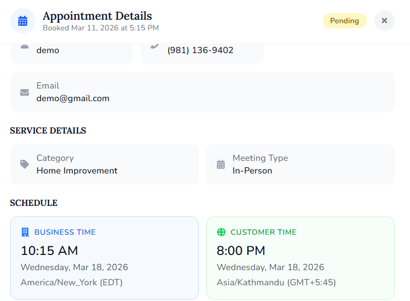
    <div class="slabel" style="--sl:5%"><span>Modal Header<em>appointment title, booking date and current status</em></span></div>
    <div class="slabel" style="--sl:38%"><span>Service Details<em>category (Home Improvement) and meeting type (In-Person)</em></span></div>
    <div class="slabel" style="--sl:62%"><span>Business Time<em>appointment time in the admin's configured timezone — America/New_York (EDT)</em></span></div>
    <div class="slabel" style="--sl:85%"><span>Customer Time<em>same appointment auto-converted to the client's local timezone — Asia/Kathmandu (GMT+5:45)</em></span></div>
  </div>
  <figcaption>Fig 7.2a — Schedule showing Business Time (EDT) alongside Customer Time (Kathmandu GMT+5:45)</figcaption>
</figure>

**Message:** The client's optional note is displayed here.

**Cancellation Details** *(shown if status is Cancelled):*
- The cancellation reason provided by the admin
- Date and time of cancellation
- If the client rescheduled, a link to view the **new appointment**

---

### 7.3 Updating Appointment Status

<figure class="screenshot side-labels">
  <div class="img-wrap">
    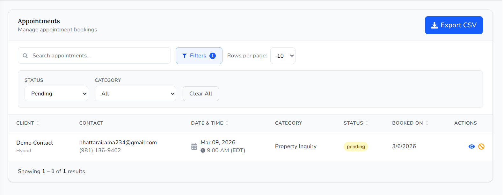
    <div class="slabel" style="--sl:10%"><span>Page Header<em>section title and Export CSV button</em></span></div>
    <div class="slabel" style="--sl:25%"><span>Active Filter Badge<em>blue "1" indicates a filter is currently applied</em></span></div>
    <div class="slabel" style="--sl:42%"><span>Filter Panel<em>narrow by status (Pending) and category with Clear All</em></span></div>
    <div class="slabel" style="--sl:62%"><span>Filtered Result<em>appointment row matching the active status filter</em></span></div>
    <div class="slabel" style="--sl:85%"><span>Result Count<em>shows how many appointments match the current filter</em></span></div>
  </div>
  <figcaption>Fig 7.3 — Status update buttons: 1) Pending 2) Confirm 3) Complete 4) Cancel</figcaption>
</figure>

From the Appointment Details modal footer, use the action buttons to update status:

| Button | Moves Status To | When to Use |
|--------|----------------|-------------|
| **Pending** | `pending` | Acknowledge booking, awaiting confirmation |
| **Confirm** | `confirmed` | Appointment has been confirmed with the client |
| **Complete** | `completed` | After the appointment has taken place |
| **Cancel** | Opens cancellation modal | When appointment must be cancelled |

> **Important:** When an appointment is marked **Completed**, the system automatically sends the client a **survey invite** by email, asking them to rate their experience.

---

### 7.4 Cancelling an Appointment (With Reason)

Cancelling an appointment is a two-step process:

1. Click the **Cancel** button in the appointment detail modal footer.
2. The **Cancel Appointment** modal opens. You must provide a **cancellation reason** (minimum 10 characters).
3. Click **Cancel Appointment** to confirm.

<figure class="screenshot side-labels">
  <div class="img-wrap">
    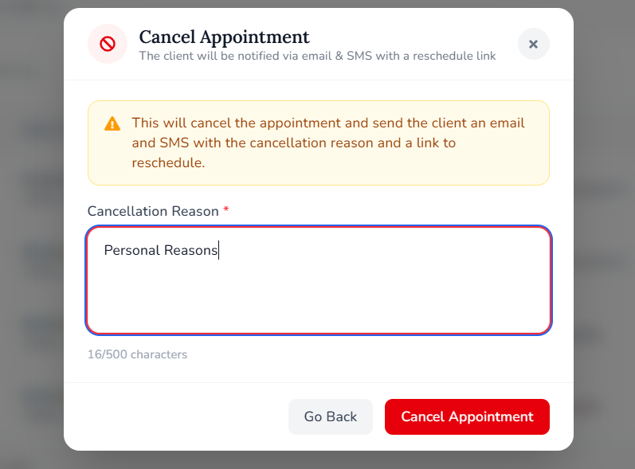
    <div class="slabel" style="--sl:9%"><span>Modal Header<em>title and notification reminder — email &amp; SMS will be sent</em></span></div>
    <div class="slabel" style="--sl:28%"><span>Warning Banner<em>explains what will happen when cancellation is confirmed</em></span></div>
    <div class="slabel" style="--sl:52%"><span>Cancellation Reason<em>required field — minimum 10 characters</em></span></div>
    <div class="slabel" style="--sl:72%"><span>Character Counter<em>tracks input length against the 500-character limit</em></span></div>
    <div class="slabel" style="--sl:91%"><span>Action Buttons<em>Go Back to return, or Cancel Appointment to confirm</em></span></div>
  </div>
  <figcaption>Fig 7.4 — Cancel Appointment modal requiring a reason before confirming cancellation</figcaption>
</figure>

**What happens automatically:**
- The appointment status is set to `cancelled`.
- The client receives an **email and SMS** with:
  - Your cancellation reason/explanation.
  - A personalized **reschedule link** so they can book a new time slot.

<figure class="screenshot side-labels">
  <div class="img-wrap">
    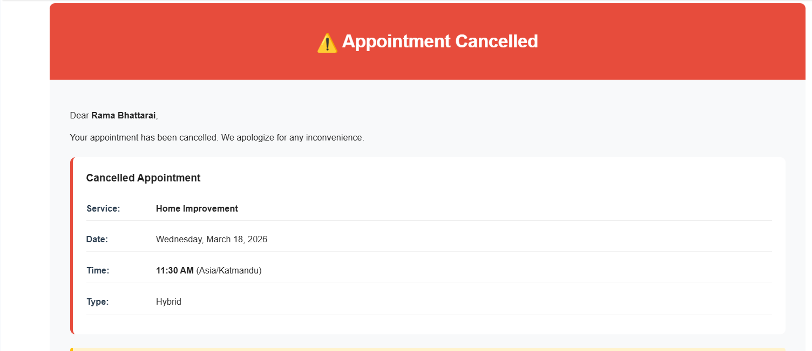
    <div class="slabel" style="--sl:10%"><span>Email Header<em>red banner confirming the appointment is cancelled</em></span></div>
    <div class="slabel" style="--sl:32%"><span>Greeting &amp; Message<em>personalised notice sent directly to the client</em></span></div>
    <div class="slabel" style="--sl:62%"><span>Appointment Details<em>service, date, time and meeting type of the cancelled booking</em></span></div>
    <div class="slabel" style="--sl:88%"><span>Reschedule Section<em>link for the client to book a new time slot</em></span></div>
  </div>
  <figcaption>Fig 7.5 — Cancellation email sent to the client with appointment details and reschedule link</figcaption>
</figure>

This ensures a professional and transparent experience for the client.

---

### 7.5 Disabling & Enabling Appointments

**Disabling** is different from cancelling. A disabled appointment:
- Remains visible in the dashboard (it is **not deleted**).
- Cannot have its status changed.
- Does not show up to clients.

**To disable:** Click the **ban icon (🚫)** in the Actions column. Confirm the dialog.

**To enable (re-activate):** Disabled appointments show a **checkmark icon (✓)**. Click it to re-enable.

Disabled appointments show a **"Disabled" badge** on the client name in the table.

---

### 7.6 Rescheduled Appointments

When a client follows the reschedule link sent via cancellation email, a **new appointment** is created. The system automatically:
- Links the new appointment to the original via `rescheduledFrom`.
- Links the original appointment to the new one via `rescheduledTo`.
- Shows a **"Rescheduled" badge** (indigo) on the new appointment in the table.
- Displays "View original" and "View new" buttons in the respective modals so you can traverse the history easily.

<figure class="screenshot side-labels">
  <div class="img-wrap">
    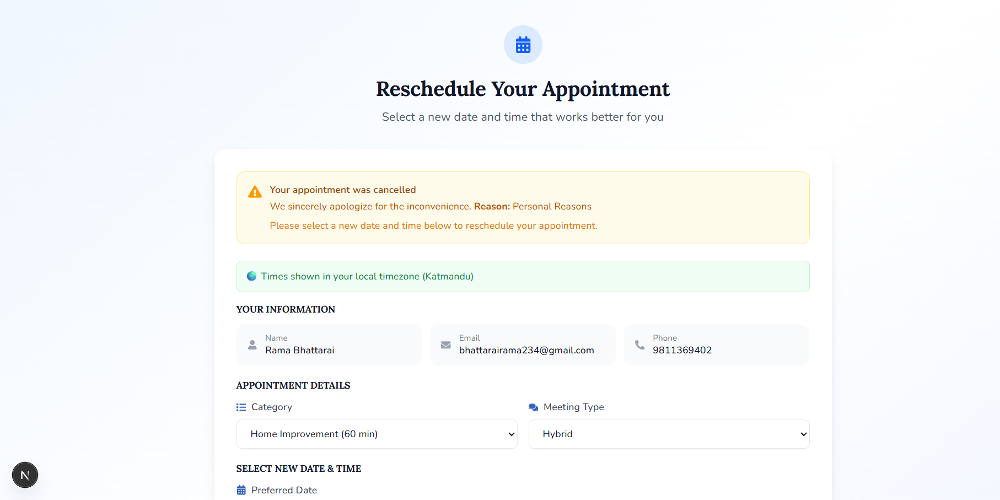
    <div class="slabel" style="--sl:10%"><span>Page Title<em>reschedule page opened from the cancellation email link</em></span></div>
    <div class="slabel" style="--sl:35%"><span>Cancellation Notice<em>yellow banner showing the reason for cancellation</em></span></div>
    <div class="slabel" style="--sl:57%"><span>Timezone Notice<em>confirms times are shown in the client's local timezone</em></span></div>
    <div class="slabel" style="--sl:88%"><span>Your Information &amp; Appointment Details<em>pre-filled client info, category and meeting type</em></span></div>
  </div>
  <figcaption>Fig 7.6 — Reschedule page: cancellation notice and pre-filled client details</figcaption>
</figure>

<figure class="screenshot side-labels">
  <div class="img-wrap">
    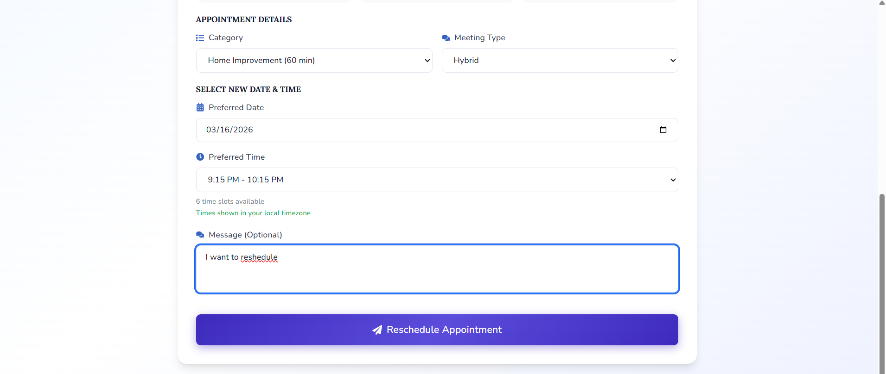
    <div class="slabel" style="--sl:10%"><span>Appointment Details<em>category and meeting type carried over from original booking</em></span></div>
    <div class="slabel" style="--sl:30%"><span>Preferred Date<em>date picker to select a new appointment date</em></span></div>
    <div class="slabel" style="--sl:52%"><span>Preferred Time<em>available slots shown in the client's local timezone</em></span></div>
    <div class="slabel" style="--sl:70%"><span>Message<em>optional note to include with the new booking</em></span></div>
    <div class="slabel" style="--sl:90%"><span>Submit Button<em>click to confirm and create the rescheduled appointment</em></span></div>
  </div>
  <figcaption>Fig 7.7 — Reschedule form: select a new date, time slot and optional message</figcaption>
</figure>

<figure class="screenshot side-labels">
  <div class="img-wrap">
    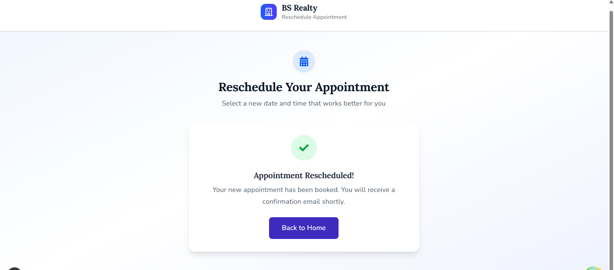
    <div class="slabel" style="--sl:18%"><span>Page Title<em>confirms the client is on the reschedule page</em></span></div>
    <div class="slabel" style="--sl:52%"><span>Success Confirmation<em>green checkmark and "Appointment Rescheduled!" message</em></span></div>
    <div class="slabel" style="--sl:85%"><span>Back to Home<em>returns the client to the main website</em></span></div>
  </div>
  <figcaption>Fig 7.8 — Reschedule complete: confirmation screen shown after successful rebooking</figcaption>
</figure>

---

### 7.7 Exporting Appointments to CSV

Click **Export CSV** in the top-right of the Appointments page. The export includes all currently filtered appointments with these fields:
- ID, Name, Email, Phone, Appointment Date, Time, Category, Preference, Message, Status, Created At, Updated At.

<figure class="screenshot side-labels">
  <div class="img-wrap">
    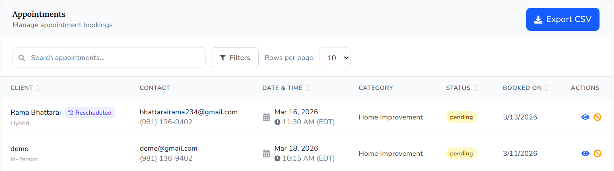
    <div class="slabel" style="--sl:10%"><span>Export CSV Button<em>downloads all currently filtered appointments as a spreadsheet</em></span></div>
    <div class="slabel" style="--sl:35%"><span>Search &amp; Filters<em>apply filters before exporting to narrow the dataset</em></span></div>
    <div class="slabel" style="--sl:58%"><span>Rescheduled Badge<em>indigo badge marks appointments rebooked after a cancellation</em></span></div>
    <div class="slabel" style="--sl:85%"><span>Appointment Rows<em>every visible row is included in the exported CSV file</em></span></div>
  </div>
  <figcaption>Fig 7.9 — Appointments list with Export CSV — filters applied before export narrow the output</figcaption>
</figure>

---

## 8. Managing Property Inquiries

**Navigate to:** `/dashboard/property-inquiries`

Lists all property inquiry form submissions.

<figure class="screenshot side-labels">
  <div class="img-wrap">
    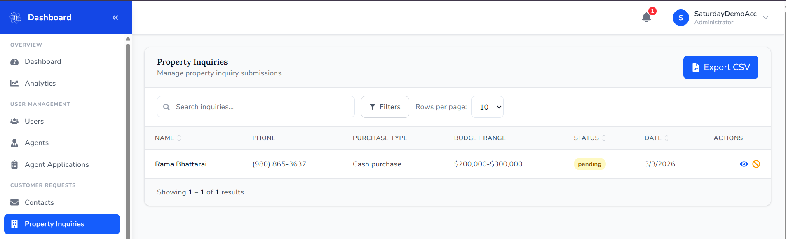
    <div class="slabel" style="--sl:8%"><span>Page Header<em>section title and Export CSV button</em></span></div>
    <div class="slabel" style="--sl:48%"><span>Inquiry Row<em>client details with purchase type, budget range and status badge</em></span></div>
    <div class="slabel" style="--sl:85%"><span>Action Buttons<em>view full inquiry details or disable the record</em></span></div>
  </div>
  <figcaption>Fig 8.1 — Property Inquiries admin list showing submissions, status badges and action controls</figcaption>
</figure>

**Column overview:**
- Name, Phone, Email
- Preferred Contact Method (Phone, Text, or Email)
- Real Estate Needs (Buy, Sell, Rent, etc.)
- Status badge

**Status lifecycle:** `new` → `pending` → `completed` | `cancelled`

**Actions:**
- Click the **eye icon** to view full inquiry details including budget, timeline, locations, financing type, investment interests, and insurance interests.
- Update the status via the detail modal.
- **Export CSV** button available for reporting.

---

## 9. Managing Insurance Quotes

**Navigate to:** `/dashboard/insurance-quotes`

Lists all insurance quote requests.

**Key data shown:**
- Full name, date of birth, contact info
- Quote types requested (Auto, Home, Commercial, Workers' Comp)
- Marital status, occupation
- Status badge

**Viewing details reveals:**
- Complete auto section (vehicle info, prior carrier, coverage preferences, accident/violation history)
- Complete property section (property address, dwelling usage, foundation, roof type)
- Co-applicant details

**Status lifecycle:** `new` → `pending` → `responded` → `closed`

> Note: The "responded" status is unique to insurance quotes, indicating a quote has been sent to the client.

---

## 10. Managing Home Improvement Quotes

**Navigate to:** `/dashboard/home-improvement-quotes`

Lists all home improvement quote requests.

<figure class="screenshot side-labels">
  <div class="img-wrap">
    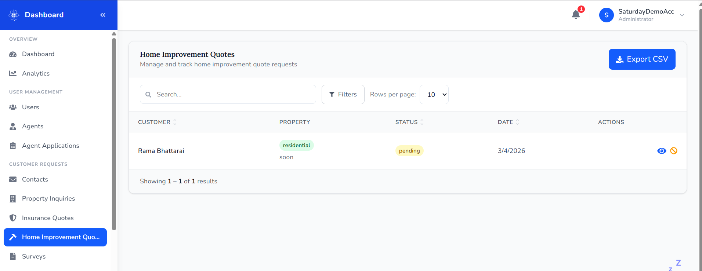
    <div class="slabel" style="--sl:8%"><span>Page Header<em>section title and Export CSV button</em></span></div>
    <div class="slabel" style="--sl:48%"><span>Quote Row<em>customer name, property type, timeline and status badge</em></span></div>
    <div class="slabel" style="--sl:85%"><span>Action Buttons<em>view full quote details or disable the record</em></span></div>
  </div>
  <figcaption>Fig 10.1 — Home Improvement Quotes admin list showing submissions, status badges and action controls</figcaption>
</figure>

**Data shown:**
- Customer name, email, phone
- Type of help needed
- Property type (Residential or Commercial)
- Timeline
- Status

**Detail view shows:**
- Full project description
- Specific areas of work
- Items to install/replace
- Property address
- Whether the client wants text/email updates

**Status lifecycle:** `new` → `pending` → `completed` | `cancelled`

---

## 11. Managing Job Applications

**Navigate to:** `/dashboard/job-applications`

Lists applications submitted for posted job positions.

<figure class="screenshot side-labels">
  <div class="img-wrap">
    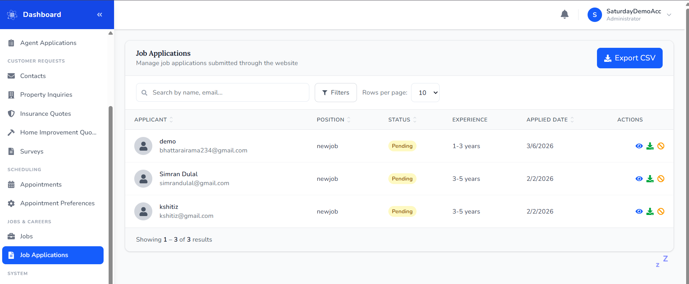
    <div class="slabel" style="--sl:8%"><span>Page Header<em>section title and Export CSV button</em></span></div>
    <div class="slabel" style="--sl:48%"><span>Application Rows<em>applicant name, position, status badge, experience and applied date</em></span></div>
    <div class="slabel" style="--sl:85%"><span>Action Buttons<em>view details, download resume or disable the application</em></span></div>
  </div>
  <figcaption>Fig 11.1 — Job Applications list showing all submissions with status badges and action controls</figcaption>
</figure>

**Data shown:**
- Applicant name, email, phone
- Position applied for
- Work arrangement preference (Full-time, Part-time, Contract, Freelance)
- Work setting (Remote, On-site, Hybrid)
- Availability (Immediately, 2 weeks, etc.)
- Status

**Detail view reveals:**
- Technical skills and programming languages
- Years of experience
- Portfolio links and past project descriptions
- Certifications
- Why they want to work at BS Realty
- Resume download link (original filename preserved)

<figure class="screenshot side-labels">
  <div class="img-wrap">
    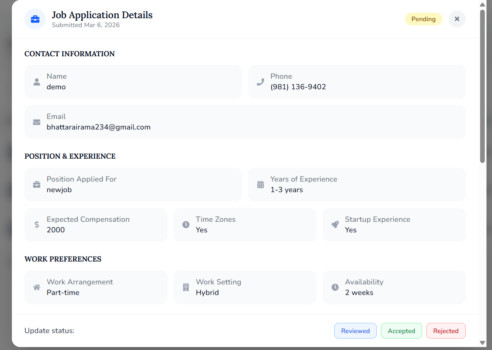
    <div class="slabel" style="--sl:7%"><span>Modal Header<em>title, submission date, current status badge &amp; close</em></span></div>
    <div class="slabel" style="--sl:28%"><span>Contact Information<em>applicant name, phone and email</em></span></div>
    <div class="slabel" style="--sl:52%"><span>Position &amp; Experience<em>role applied for, years of experience, compensation &amp; timezone</em></span></div>
    <div class="slabel" style="--sl:75%"><span>Work Preferences<em>work arrangement, setting (Hybrid) and availability</em></span></div>
    <div class="slabel" style="--sl:93%"><span>Update Status<em>mark as Reviewed, Accepted or Rejected</em></span></div>
  </div>
  <figcaption>Fig 11.2 — Job Application detail modal: contact info, position, experience and work preferences</figcaption>
</figure>

<figure class="screenshot side-labels">
  <div class="img-wrap">
    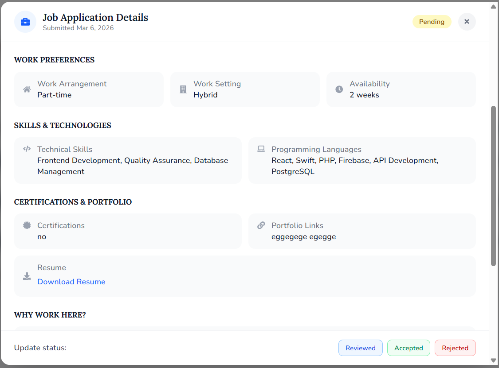
    <div class="slabel" style="--sl:8%"><span>Work Preferences<em>arrangement, setting and availability carried from Part 1</em></span></div>
    <div class="slabel" style="--sl:32%"><span>Skills &amp; Technologies<em>technical skills and programming languages listed</em></span></div>
    <div class="slabel" style="--sl:57%"><span>Certifications &amp; Portfolio<em>certifications, portfolio links and resume download</em></span></div>
    <div class="slabel" style="--sl:78%"><span>Why Work Here?<em>applicant's motivation for joining BS Realty</em></span></div>
    <div class="slabel" style="--sl:95%"><span>Update Status<em>mark as Reviewed, Accepted or Rejected</em></span></div>
  </div>
  <figcaption>Fig 11.3 — Job Application detail modal: skills, certifications, portfolio and status controls</figcaption>
</figure>

**Status lifecycle:** `new` → `pending` → `reviewed` → `accepted` | `rejected`

**Actions:**
- Update status (reject or accept applicants)
- Disable/Enable applications
- Export CSV

---

## 12. Managing Agent Applications

**Navigate to:** `/dashboard/agent-applications`

Lists all applicants who want to join BS Realty as agents.

<figure class="screenshot side-labels">
  <div class="img-wrap">
    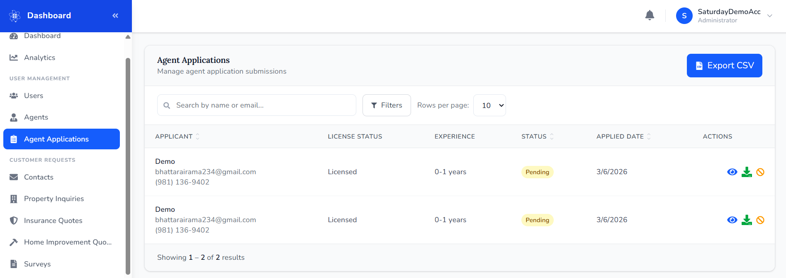
    <div class="slabel" style="--sl:8%"><span>Page Header<em>section title and Export CSV button</em></span></div>
    <div class="slabel" style="--sl:48%"><span>Application Rows<em>applicant name, license status, experience and status badge</em></span></div>
    <div class="slabel" style="--sl:85%"><span>Action Buttons<em>view details, download documents or disable the application</em></span></div>
  </div>
  <figcaption>Fig 12.1 — Agent Applications list showing submissions, license status and action controls</figcaption>
</figure>

**Data shown:**
- Applicant name, email, phone
- License status (Licensed, Inactive, Expired, Pre-licensing, None)
- Years of real estate experience
- Availability (Full-time, Part-time, or Both)
- Status

**Detail view reveals:**
- License number and states licensed
- Current brokerage affiliation
- Areas of expertise
- Work eligibility (US Citizen, Visa type, etc.)
- How they heard about BS Realty
- Referrer name (if applicable)
- Resume, license document, and ID card download links

**Status lifecycle:** `new` → `pending` → `reviewed` → `accepted` | `rejected`

<figure class="screenshot side-labels">
  <div class="img-wrap">
    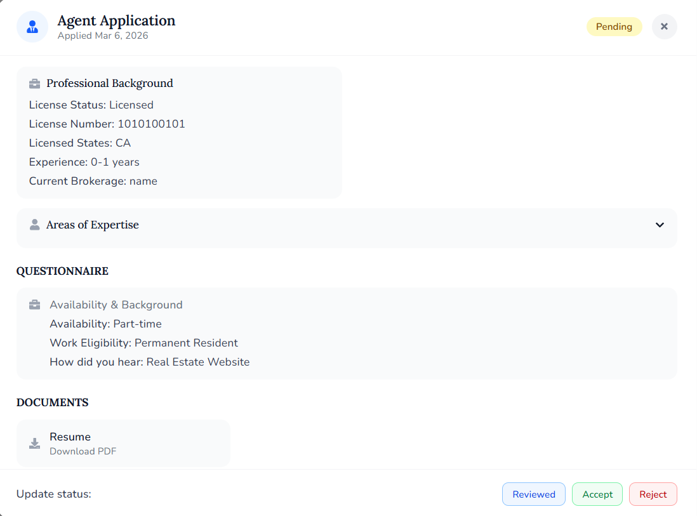
    <div class="slabel" style="--sl:6%"><span>Modal Header<em>title, application date, current status badge &amp; close</em></span></div>
    <div class="slabel" style="--sl:27%"><span>Professional Background<em>license status, number, states, experience &amp; current brokerage</em></span></div>
    <div class="slabel" style="--sl:52%"><span>Questionnaire<em>availability, work eligibility and how they heard about BS Realty</em></span></div>
    <div class="slabel" style="--sl:73%"><span>Documents<em>resume and license documents available to download</em></span></div>
    <div class="slabel" style="--sl:92%"><span>Update Status<em>mark as Reviewed, Accept or Reject the applicant</em></span></div>
  </div>
  <figcaption>Fig 12.2 — Agent Application detail modal showing professional background, questionnaire and documents</figcaption>
</figure>

**Actions:**
- Update status to accept or reject candidates
- Disable/Enable applications
- Export CSV

---

## 13. User Management

**Navigate to:** `/dashboard/users`

Provides an overview of all registered users in the system.

**User roles:**

| Role | Description |
|------|-------------|
| **Admin** | Full access to all dashboard features and configuration |
| **Agent** | Operational access to manage client-facing modules |
| **Client** | Public-facing users who register on the website |

**User status:**
- **Active** – User can log in and access the system.
- **Inactive** – User account is deactivated.

**Approval workflow:**
- When a new client or agent registers, their account status starts as `new`.
- Admins review and approve/reject via the Users module.
- After approval, users can log in.

**Admin actions:**
- View user details (name, email, role, registration date)
- Toggle active/inactive status
- Approve or reject pending user registrations

---

## 14. Analytics

**Navigate to:** `/dashboard/analytics`

Provides data insights on system activity and form submission trends.

<figure class="screenshot side-labels">
  <div class="img-wrap">
    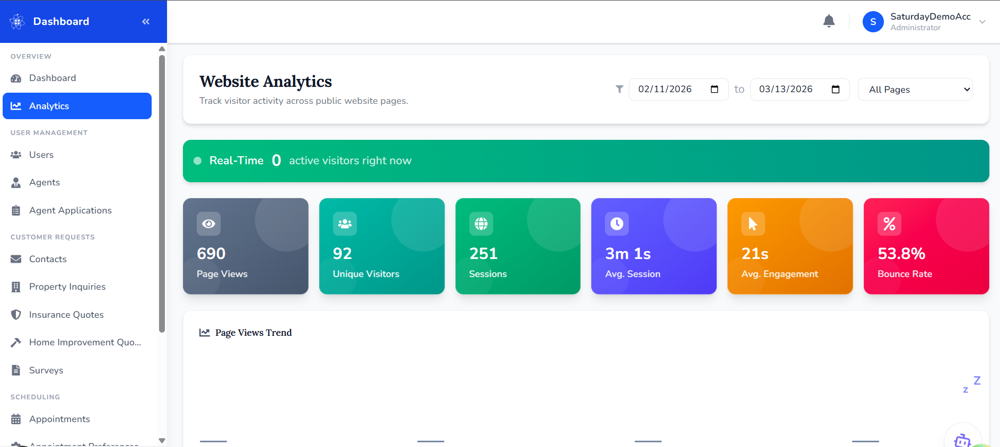
    <div class="slabel" style="--sl:10%"><span>Page Header &amp; Date Filter<em>title, date range picker and page filter dropdown</em></span></div>
    <div class="slabel" style="--sl:28%"><span>Real-Time Banner<em>shows active visitors on the site right now</em></span></div>
    <div class="slabel" style="--sl:52%"><span>Stat Cards<em>page views, unique visitors, sessions, avg. session, engagement &amp; bounce rate</em></span></div>
    <div class="slabel" style="--sl:82%"><span>Page Views Trend<em>chart showing traffic volume over the selected date range</em></span></div>
  </div>
  <figcaption>Fig 14.1 — Website Analytics overview: real-time visitors, key metrics and page views trend</figcaption>
</figure>

<figure class="screenshot side-labels">
  <div class="img-wrap">
    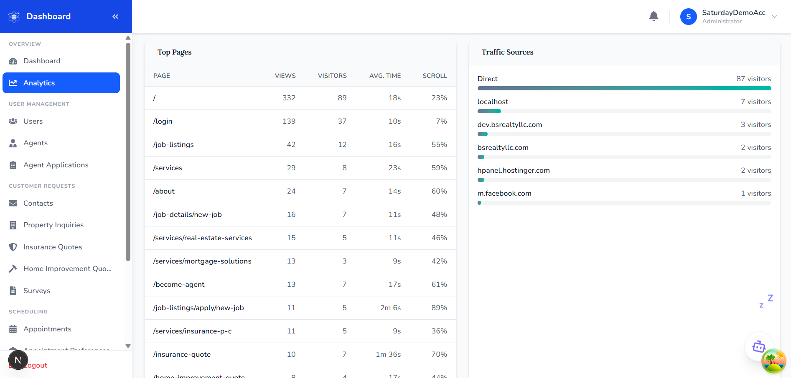
    <div class="slabel" style="--sl:8%"><span>Top Pages Table<em>ranked URLs with views, visitors, avg. time and scroll depth</em></span></div>
    <div class="slabel" style="--sl:35%"><span>Traffic Sources<em>visitor origins — direct, referral domains and social</em></span></div>
    <div class="slabel" style="--sl:75%"><span>Engagement Metrics<em>scroll depth and average time on page per URL</em></span></div>
  </div>
  <figcaption>Fig 14.2 — Top Pages and Traffic Sources showing where visitors come from and what they view</figcaption>
</figure>

<figure class="screenshot side-labels">
  <div class="img-wrap">
    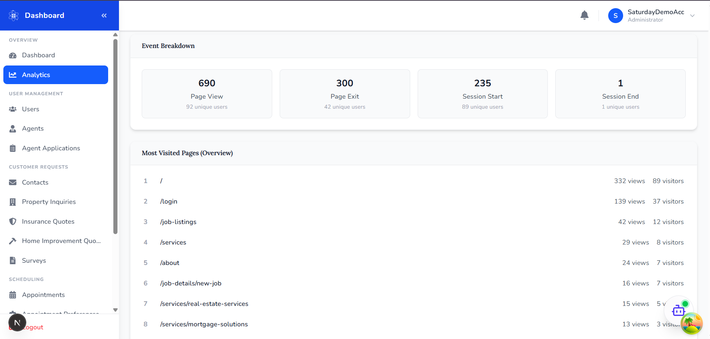
    <div class="slabel" style="--sl:10%"><span>Event Breakdown<em>page views, exits, session starts and ends with unique user counts</em></span></div>
    <div class="slabel" style="--sl:65%"><span>Most Visited Pages<em>ranked overview of top URLs by total views and visitor count</em></span></div>
  </div>
  <figcaption>Fig 14.3 — Event Breakdown and Most Visited Pages overview</figcaption>
</figure>

The analytics dashboard captures and displays event-based data including:
- Submission volume over time (contacts, appointments, inquiries, quotes, applications)
- Status distribution charts
- Activity trends by service category
- Peak activity periods

> Analytics data is event-driven — every form submission, status change, and registration is tracked as an `AnalyticsEvent` in the system.

---

## 15. Surveys & Testimonials

**Navigate to:** `/dashboard/surveys`

The Survey system is **automatically triggered** when an appointment is marked as **Completed**. The client receives an email with a personalized survey link.

### Step 1 — Survey Email Sent to Client

<figure class="screenshot side-labels">
  <div class="img-wrap">
    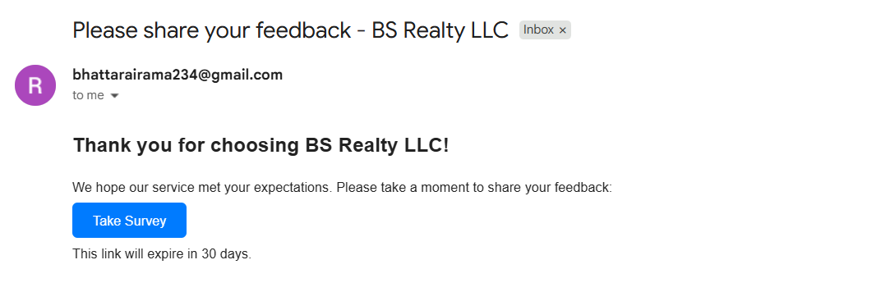
    <div class="slabel" style="--sl:10%"><span>Email Subject<em>sent automatically when appointment is marked Completed</em></span></div>
    <div class="slabel" style="--sl:50%"><span>Take Survey Button<em>click to open the personalised survey form</em></span></div>
    <div class="slabel" style="--sl:85%"><span>Expiry Notice<em>link expires after 30 days</em></span></div>
  </div>
  <figcaption>Fig 15.1 — Survey invitation email sent to the client after appointment is completed</figcaption>
</figure>

### Step 2 — Client Fills in the Survey Form

<figure class="screenshot side-labels">
  <div class="img-wrap">
    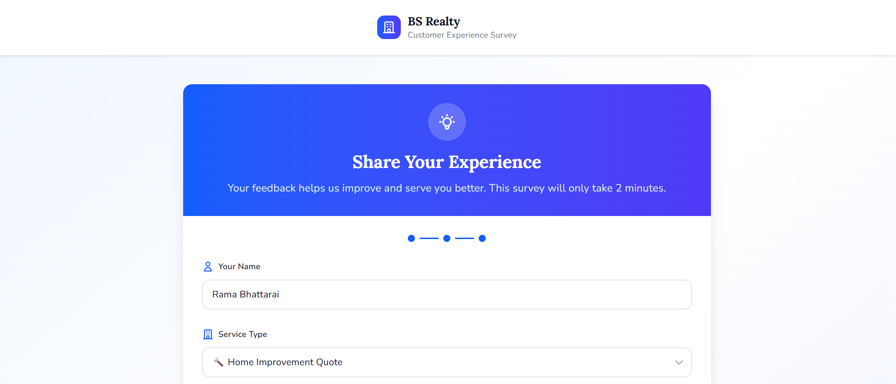
    <div class="slabel" style="--sl:8%"><span>Page Header<em>BS Realty branding and Customer Experience Survey label</em></span></div>
    <div class="slabel" style="--sl:30%"><span>Form Banner<em>"Share Your Experience" heading and survey description</em></span></div>
    <div class="slabel" style="--sl:55%"><span>Step Progress<em>multi-step indicator showing current position</em></span></div>
    <div class="slabel" style="--sl:85%"><span>Personal Details<em>pre-filled name and service type from the appointment</em></span></div>
  </div>
  <figcaption>Fig 15.2 — Survey form Step 1: client name and service type pre-filled from the appointment</figcaption>
</figure>

<figure class="screenshot side-labels">
  <div class="img-wrap">
    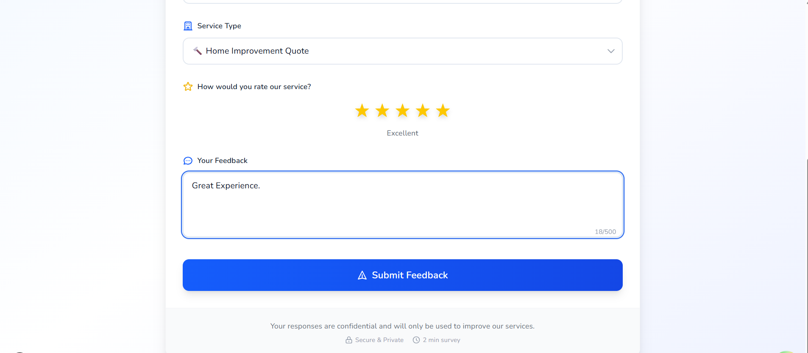
    <div class="slabel" style="--sl:10%"><span>Service Type<em>carried over from the appointment booking</em></span></div>
    <div class="slabel" style="--sl:32%"><span>Star Rating<em>client rates service from 1 to 5 stars</em></span></div>
    <div class="slabel" style="--sl:60%"><span>Feedback Field<em>written comments — up to 500 characters</em></span></div>
    <div class="slabel" style="--sl:85%"><span>Submit Feedback<em>click to send the survey response</em></span></div>
  </div>
  <figcaption>Fig 15.3 — Survey form: star rating, written feedback and Submit Feedback button</figcaption>
</figure>

### Step 3 — Submission Confirmation

<figure class="screenshot side-labels">
  <div class="img-wrap">
    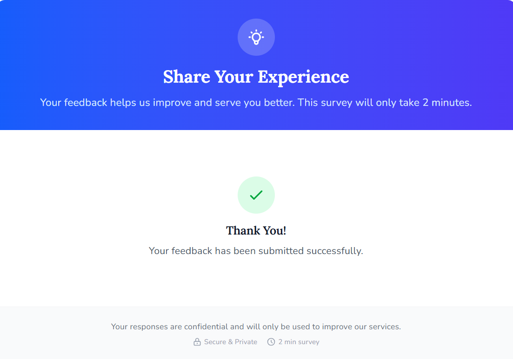
    <div class="slabel" style="--sl:12%"><span>Form Banner<em>survey page header remains visible after submission</em></span></div>
    <div class="slabel" style="--sl:52%"><span>Success Confirmation<em>green checkmark and "Thank You!" message</em></span></div>
    <div class="slabel" style="--sl:88%"><span>Privacy Notice<em>confirms responses are confidential and used only for improvement</em></span></div>
  </div>
  <figcaption>Fig 15.4 — Survey submitted successfully — client sees confirmation screen</figcaption>
</figure>

### Step 4 — Survey Arrives in Admin Dashboard (Quarantined)

<figure class="screenshot side-labels">
  <div class="img-wrap">
    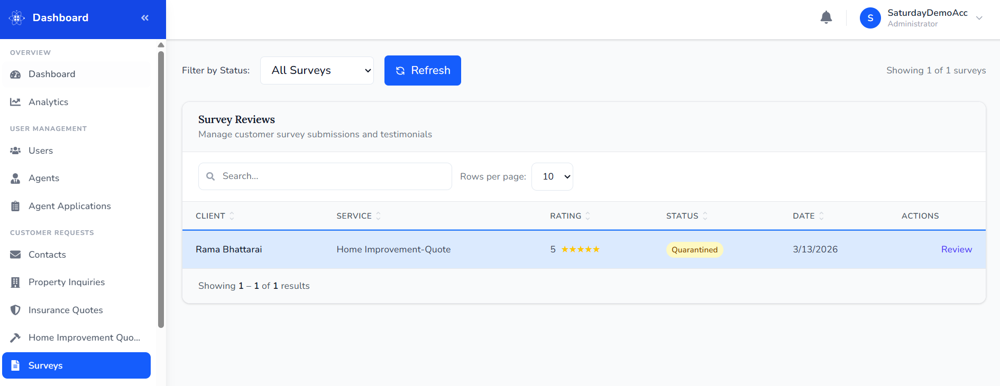
    <div class="slabel" style="--sl:8%"><span>Filter &amp; Refresh<em>filter by status and refresh to see new submissions</em></span></div>
    <div class="slabel" style="--sl:48%"><span>Quarantined Badge<em>new survey held for review — not yet visible to the public</em></span></div>
    <div class="slabel" style="--sl:85%"><span>Review Link<em>click to open the survey detail and take action</em></span></div>
  </div>
  <figcaption>Fig 15.5 — Survey arrives in the admin dashboard with "Quarantined" status pending review</figcaption>
</figure>

### Step 5 — Admin Reviews and Publishes

<figure class="screenshot side-labels">
  <div class="img-wrap">
    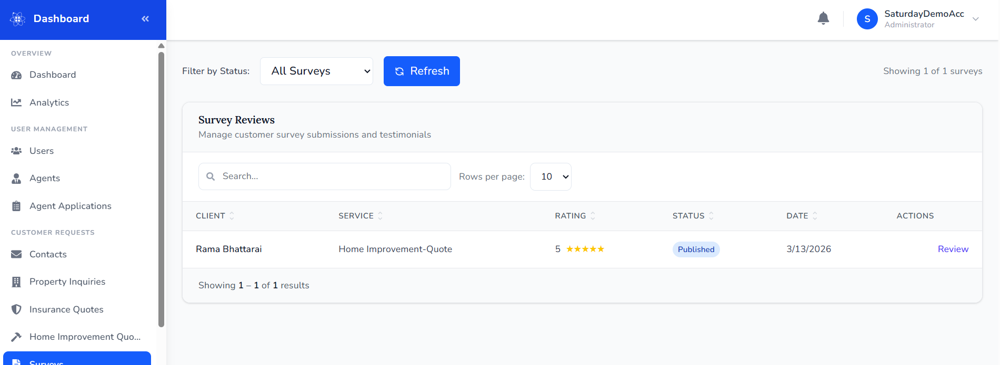
    <div class="slabel" style="--sl:8%"><span>Filter &amp; Refresh<em>use status filter to view only published surveys</em></span></div>
    <div class="slabel" style="--sl:48%"><span>Published Badge<em>survey approved and published — now visible on the website</em></span></div>
    <div class="slabel" style="--sl:85%"><span>Review Link<em>click to re-open and edit or change the status if needed</em></span></div>
  </div>
  <figcaption>Fig 15.6 — Survey marked as Published — testimonial is now live on the website</figcaption>
</figure>

### Step 6 — Testimonial Appears on the Website

<figure class="screenshot side-labels">
  <div class="img-wrap">
    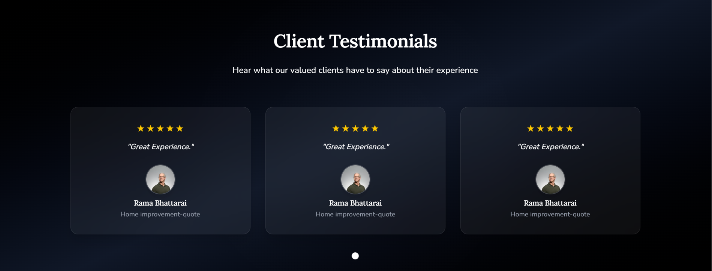
    <div class="slabel" style="--sl:20%"><span>Section Heading<em>"Client Testimonials" — visible to all website visitors</em></span></div>
    <div class="slabel" style="--sl:62%"><span>Testimonial Cards<em>star rating, feedback quote, client name and service type</em></span></div>
  </div>
  <figcaption>Fig 15.7 — Published testimonials displayed in the Client Testimonials section of the website</figcaption>
</figure>

### Survey Response Lifecycle

| Status | Meaning |
|--------|---------|
| `quarantined` | Survey just received, pending admin review |
| `approved` | Admin has reviewed and approved the response |
| `rejected` | Admin decided not to publish this review |
| `published` | Shown publicly on the website as a testimonial |

### Admin Actions on Surveys

1. **Review** – Read the rating (1–5 stars) and the client's written feedback.
2. **Edit** – Optionally rephrase or clean up the feedback text before approval (the `editedText` field stores the edited version).
3. **Approve** – Mark the survey as approved.
4. **Publish** – Once approved, publish it to display on the website's Testimonials section.
5. **Reject** – Mark unsuitable surveys as rejected.

> Surveys that are `quarantined` or `rejected` are **never shown** to the public. Only `published` surveys appear on the homepage.

---

## 16. Appointment Preferences (Configuration)

**Navigate to:** `/dashboard/appointment-preferences`

This section is where admins configure **how the appointment booking system works**. There are four subsections:

### 16.1 Appointment Categories

<figure class="screenshot side-labels">
  <div class="img-wrap">
    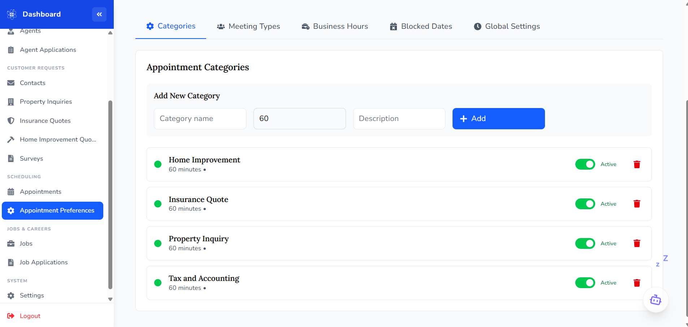
    <div class="slabel" style="--sl:8%"><span>Tab Navigation<em>switch between Categories, Meeting Types, Business Hours and more</em></span></div>
    <div class="slabel" style="--sl:27%"><span>Add New Category<em>enter name, duration (minutes) and description then click Add</em></span></div>
    <div class="slabel" style="--sl:55%"><span>Category Rows<em>name with green active dot and duration shown per category</em></span></div>
    <div class="slabel" style="--sl:82%"><span>Active Toggle &amp; Delete<em>enable/disable a category or remove it entirely</em></span></div>
  </div>
  <figcaption>Fig 16.1 — Appointment categories management with durations and active status</figcaption>
</figure>

Categories define the **type of service** a client is booking.

**Each category has:**
- **Name** – e.g., "Real Estate Consultation"
- **Duration** – How long the appointment lasts (15 to 480 minutes / up to 8 hours)
- **Description** – What the category covers
- **Active/Inactive** – Toggle to make it available or hidden from the booking form
- **Sort Order** – Controls display order in the booking form

**Default categories:**
- Real Estate Consultation
- Mortgage Services
- Home Improvement
- Tax and Accounting
- Other

**Admin actions:**
- Add new categories
- Edit duration and descriptions
- Activate or deactivate categories

---

### 16.2 Meeting Preferences

<figure class="screenshot side-labels">
  <div class="img-wrap">
    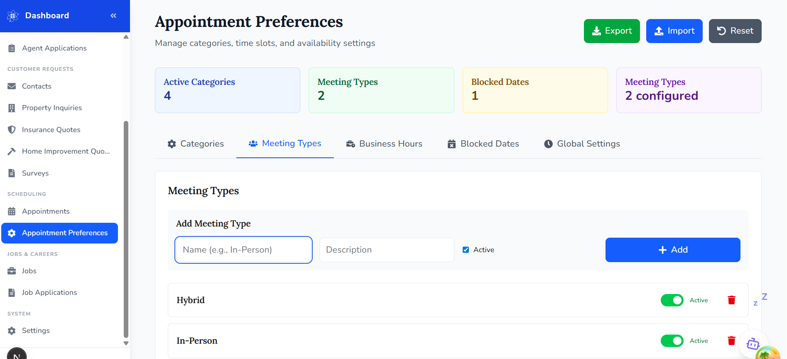
    <div class="slabel" style="--sl:8%"><span>Page Header &amp; Actions<em>Appointment Preferences title with Export, Import and Reset buttons</em></span></div>
    <div class="slabel" style="--sl:23%"><span>Summary Cards<em>live counts of active categories, meeting types and blocked dates</em></span></div>
    <div class="slabel" style="--sl:50%"><span>Add Meeting Type<em>enter name, description and active status then click Add</em></span></div>
    <div class="slabel" style="--sl:82%"><span>Meeting Type Rows<em>existing types (Hybrid, In-Person) with active toggle and delete</em></span></div>
  </div>
  <figcaption>Fig 16.2 — Meeting Types configuration showing existing types and the add new type form</figcaption>
</figure>

Preferences define **how a meeting is conducted** — for example, In-Person vs. Virtual vs. Phone.

**Each preference has:**
- **Name** – e.g., "In-Person Meeting"
- **Description** – Details about this meeting type
- **Business Hours** – A schedule per day of week (Mon–Sun), with open/close times. This is independent per preference.
- **Allow Online Booking** – Whether clients can book this type via the website
- **Requires Special Equipment** – Flag for internal planning
- **Active/Inactive** – Toggle visibility on the booking form

**Why this matters:** The available **time slots** on the booking form depend entirely on the preference's business hours setup. If a preference is closed on Fridays, no Friday slots will appear when that preference is selected.

---

### 16.3 Business Hours

<figure class="screenshot side-labels">
  <div class="img-wrap">
    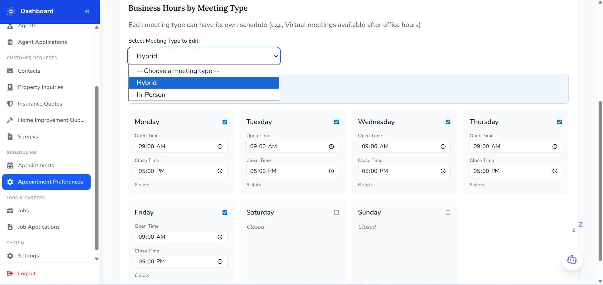
    <div class="slabel" style="--sl:8%"><span>Page Title<em>business hours are configured independently per meeting type</em></span></div>
    <div class="slabel" style="--sl:22%"><span>Meeting Type Selector<em>choose which meeting type (Hybrid, In-Person) to configure</em></span></div>
    <div class="slabel" style="--sl:55%"><span>Weekday Schedule<em>open &amp; close times with available slot count per day</em></span></div>
    <div class="slabel" style="--sl:85%"><span>Weekend Schedule<em>Saturday and Sunday shown as Closed by default</em></span></div>
  </div>
  <figcaption>Fig 16.2 — Business hours setup showing daily schedules and break periods</figcaption>
</figure>

Global business hours define overall open/closed days and break times. These serve as a **secondary layer** of availability checking (on top of preference-specific hours).

**For each day (Sunday through Saturday):**
- **Open/Closed toggle**
- **Start Time** and **End Time**
- **Break Times** – You can add multiple break periods (e.g., 12:00–13:00 for lunch). Appointments cannot be booked during break windows.

---

### 16.4 Blocked Dates

<figure class="screenshot side-labels">
  <div class="img-wrap">
    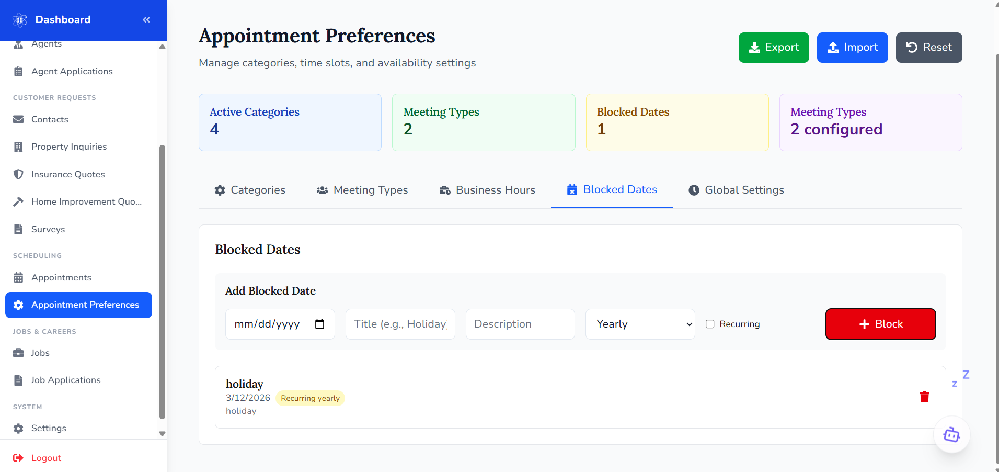
    <div class="slabel" style="--sl:8%"><span>Page Header &amp; Actions<em>Appointment Preferences title with Export, Import and Reset</em></span></div>
    <div class="slabel" style="--sl:28%"><span>Summary Cards &amp; Tabs<em>live counts overview with Blocked Dates tab active</em></span></div>
    <div class="slabel" style="--sl:55%"><span>Add Blocked Date<em>date picker, title, description, recurrence setting and Block button</em></span></div>
    <div class="slabel" style="--sl:85%"><span>Blocked Date Row<em>existing entry with "Recurring yearly" badge and delete button</em></span></div>
  </div>
  <figcaption>Fig 16.3 — Blocked dates calendar showing holidays and unavailable periods</figcaption>
</figure>

Blocked dates prevent appointments from being booked on specific dates (e.g., holidays, company events, emergencies).

**Each blocked date has:**
- **Date** – The specific date to block
- **Title** – Free-text label (e.g., "Christmas Holiday", "Staff Training Day")
- **Description** – Optional additional details
- **All-Day vs. Time Range** – Block the entire day or just a specific time window
- **Recurring** – Optionally set the block to repeat `yearly`, `monthly`, or `weekly`
- **Active/Inactive** – Toggle to temporarily remove the block without deleting it

**Examples:**
- Block Dec 25 every year with recurrence: `yearly`
- Block lunch hour every Monday: `weekly`
- Block a single day for a one-time holiday

---

## 17. Settings Page

<figure class="screenshot side-labels">
  <div class="img-wrap">
    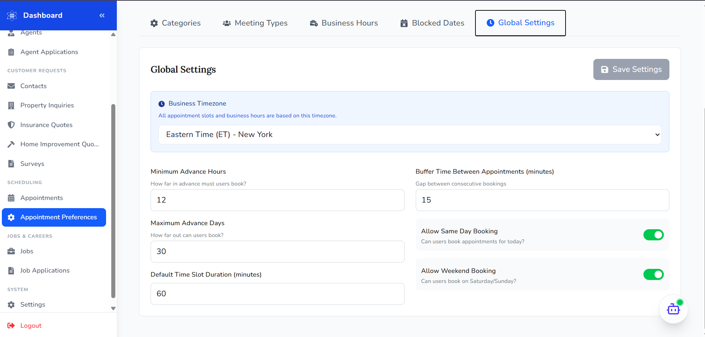
    <div class="slabel" style="--sl:6%"><span>Tab Navigation<em>Global Settings tab active — switch to other preference sections here</em></span></div>
    <div class="slabel" style="--sl:18%"><span>Page Header<em>Global Settings title and Save Settings button</em></span></div>
    <div class="slabel" style="--sl:35%"><span>Business Timezone<em>all appointment slots and hours are based on this timezone</em></span></div>
    <div class="slabel" style="--sl:62%"><span>Booking Rules<em>minimum advance hours, buffer time, max advance days and slot duration</em></span></div>
    <div class="slabel" style="--sl:85%"><span>Booking Toggles<em>allow same day and weekend booking on/off</em></span></div>
  </div>
  <figcaption>Fig 17.1 — Global settings interface with tabbed navigation and configuration options</figcaption>
</figure>

**Navigate to:** `/dashboard/settings`

The Settings page is organized into five tabs:

### Security
Password management, two-factor authentication (2FA), and session management are **handled through the central SSO portal**. A link to the SSO dashboard is provided here. You cannot change your password from within the BS Realty dashboard.

### Notifications
Control which types of events trigger email and in-app alerts:
- Contact form submissions
- New user registrations
- Appointment requests

You can also toggle **Bell Notifications** (in-app) and **SMS Notifications** on/off.

### Appearance
- **Theme:** Light or Dark *(persisted in settings)*
- **Sidebar Collapsed:** Set the sidebar to default to collapsed mode

### Language & Time
- **Language:** English, Spanish, French
- **Timezone:** UTC, Eastern Time, Pacific Time
- **Date Format:** MM/DD/YYYY | DD/MM/YYYY | YYYY-MM-DD

### Role & Access
An overview of user permission management and assignable modules. Links to User Management and Module Access controls.

> **Note:** Detailed role assignment per user is done from the **Users** section, not the Settings page.

---

## 18. Status Reference Guide

### Appointment Statuses

| Status | Badge Color | Meaning |
|--------|------------|---------|
| `new` | Blue | Just booked, no action taken yet |
| `pending` | Yellow | Acknowledged, awaiting confirmation |
| `confirmed` | Green | Confirmed with client |
| `completed` | Gray/Dark | Appointment has occurred |
| `cancelled` | Red | Cancelled (with reason, client notified) |

### Contact / Property Inquiry / Home Improvement Statuses

| Status | Meaning |
|--------|---------|
| `new` | Just received |
| `pending` | Under review |
| `completed` | Successfully resolved |
| `cancelled` | Closed without action |

### Insurance Quote Statuses

| Status | Meaning |
|--------|---------|
| `new` | Just received |
| `pending` | Being reviewed |
| `responded` | Quote has been sent to client |
| `closed` | Case closed |

### Job & Agent Application Statuses

| Status | Meaning |
|--------|---------|
| `new` | Just submitted |
| `pending` | Under review |
| `reviewed` | Team has reviewed the application |
| `accepted` | Applicant accepted |
| `rejected` | Applicant rejected |

### Survey Statuses

| Status | Meaning |
|--------|---------|
| `quarantined` | Awaiting admin review |
| `approved` | Approved for publishing |
| `rejected` | Will not be published |
| `published` | Live on website |

### User Status

| Status | Meaning |
|--------|---------|
| `new` | Newly registered, pending approval |
| `pending` | Under admin review |
| `approved` | Active and can log in |
| `rejected` | Application denied |

---

## 19. Role & Permission Guide

| Feature / Section | Admin | Agent |
|-------------------|-------|-------|
| Dashboard Overview | ✅ | ✅ |
| View Contacts | ✅ | ✅ |
| Update Contact Status | ✅ | ✅ |
| View Appointments | ✅ | ✅ |
| Cancel Appointments (with reason) | ✅ | ✅ |
| Disable/Enable Appointments | ✅ | ❌ |
| View Property Inquiries | ✅ | ✅ |
| View Insurance Quotes | ✅ | ✅ |
| View Home Improvement Quotes | ✅ | ✅ |
| View Job Applications | ✅ | ✅ |
| Accept/Reject Job Applicants | ✅ | ❌ |
| View Agent Applications | ✅ | ❌ |
| Accept/Reject Agent Applicants | ✅ | ❌ |
| User Management | ✅ | ❌ |
| Analytics | ✅ | ❌ |
| Surveys & Testimonials | ✅ | ❌ |
| Appointment Preferences Config | ✅ | ❌ |
| Blocked Dates Management | ✅ | ❌ |
| Settings | ✅ | ✅ (own profile) |
| Real-time Notifications (Bell) | ✅ | ❌ |
| Export CSV | ✅ | ✅ |

> Agents who try to access a restricted page are automatically redirected to `/dashboard` with an error notice.

---

## 20. Email Notifications — What Gets Sent Automatically

The system sends emails automatically based on specific trigger events. No manual action is required.

| Event | Email Sent to Client | Email Sent to Admin |
|-------|---------------------|---------------------|
| Appointment booked | ✅ Confirmation with date, time, category, preference | ✅ New booking alert |
| Appointment cancelled (admin cancels) | ✅ Cancellation reason + reschedule link | — |
| Appointment completed | ✅ Survey invite email | — |
| New contact form submission | — | ✅ Notification |
| New property inquiry | — | ✅ Notification |
| New insurance quote | — | ✅ Notification |
| New home improvement quote | — | ✅ Notification |
| New job application | — | ✅ Notification |
| New agent application | — | ✅ Notification |

> **Note:** If email delivery fails (e.g., SMTP connection issue), the appointment booking or form submission is **still saved** in the database. Email failure does not block the core workflow.

---

## 21. Frequently Asked Questions

**Q: A client says they didn't get a confirmation email for their appointment. What do I check?**
> A: Go to the appointment in the dashboard. If the appointment was saved successfully, the booking went through. Email delivery is logged — check with your server administrator for SMTP logs. Ask the client to check their spam/junk folder.

**Q: A time slot the client selected is showing as unavailable even though it should be open. Why?**
> A: Check the following in order: (1) Is the date blocked? Check `/dashboard/appointment-preferences` → Blocked Dates. (2) Is there already a booking at that time? Check existing appointments. (3) Is the business hours configuration for that preference and day correct? Check Meeting Preferences.

**Q: Can a client reschedule themselves?**
> A: Yes, but only after an admin cancels their appointment. When an admin cancels with a reason, the client receives an email with a unique reschedule link. Following that link allows them to pick a new date and time, which creates a new appointment in the system linked to the original.

**Q: How do I add a new job posting?**
> A: Job management is handled in the `/dashboard/jobs` section. Add the title, slug, description, location, type, salary, requirements, qualifications, skills, and what the company offers.

**Q: Can I delete a submission permanently?**
> A: Most records support **soft-disabling** (which hides them without deleting). Permanent deletion is available for appointments but use it carefully — deleted records cannot be recovered.

**Q: What happens to a survey invite if the client never fills it out?**
> A: The invite expires after a set time but the appointment status remains `completed`. No action is needed from your side.

**Q: What does "Disabled" mean on an appointment vs. "Cancelled"?**
> A: **Cancelled** = The appointment is formally cancelled; the client is notified and can reschedule. **Disabled** = An internal administrative action that hides/freezes the record without notifying the client; typically used for data cleanup or error correction.

**Q: I see "Rescheduled" badge on some appointments. What does it mean?**
> A: That appointment was created when a client used their reschedule link after a previous cancellation. The original appointment still exists in the system (with `rescheduledTo` indicating the new one). You can navigate between them using the "View original" / "View new" buttons in the detail modal.

**Q: How do I export data for reporting?**
> A: Every main section (Contacts, Appointments, Property Inquiries, etc.) has an **Export CSV** button in the top-right corner. The file downloads immediately with all current filter settings applied.

**Q: How do I change my password?**
> A: Go to `/dashboard/settings` → **Security** tab → click **"Open SSO Security Settings"**. This takes you to the central SSO portal where password and 2FA are managed.

---

*This document covers BS Realty LLC system version 1.0. For technical support or to report issues, please contact the development team.*

*Last Updated: March 2026*
